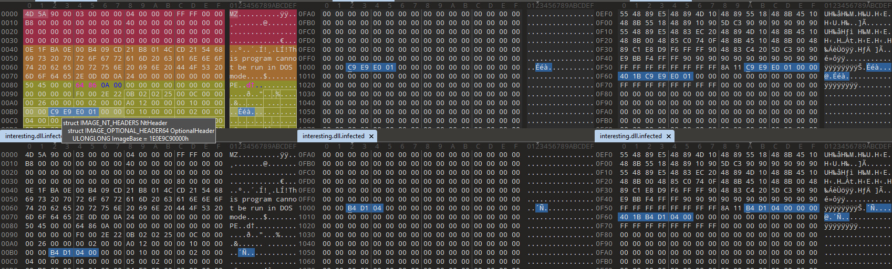

# Solving `Sandbox In a Box` Crackme

For context, it would be probably best to watch `jeFF0Falltrades`'s `Sandbox in a box` [series](https://www.youtube.com/watch?v=ELPWeRXxnSE) explaining how to build a malware analysis lab and introducing the tools and methodology used here. This post will be just me solving the crackme challenge, so let's start by downloading the binary:

```powershell
PS C:\Users\Tester\Downloads> Invoke-WebRequest https://github.com/jeFF0Falltrades/Tutorials/raw/master/master0Fnone_classes/2_Sandbox_in_a_Box/crackme/crackme.zip -Outfile crackme.zip

PS C:\Users\Tester\Downloads> 7z.exe e ./crackme.zip

7-Zip 24.08 (x64) : Copyright (c) 1999-2024 Igor Pavlov : 2024-08-11

Scanning the drive for archives:
1 file, 2117177 bytes (2068 KiB)

Extracting archive: .\crackme.zip
--
Path = .\crackme.zip
Type = zip
Physical Size = 2117177

Everything is Ok

Size:       5103616
Compressed: 2117177

PS C:\Users\Tester\Downloads> (Get-FileHash .\crackme.exe).Hash -eq "bb203ab338be9968ba5ecbdf1b53633eb15d9be82b7bc32d4e4ade86b3467788"
True
```

My first thought was to open it up with ghidra (I've actually found answers for all the challenge questions with just static analysis; only later messing with dynamic analysis).


The import page provided a bunch of information right off the bat. Identifying the binary as Golang, showing the LD flags which hinted at the binary being stripped and displaying some really odd looking dependencies. At this point i wasn't really sure what to expect as i've never reverse engineered a Golang binary before but decided to jump right in by opening it up and letting ghidra analyze it. This resulted in a fairly confusing output. This probably is not the main function.


I've decided to try and find the main function in a "Hello, World!" program as this way i would have a well known static string to look for.

```go
// hello.go
// go build -ldflags="-s -w" hello.go
package main

import "fmt"

func main() {
    fmt.Println("Hello, World!")
}

```

After some time i managed to figure out where the main function is by searching for the known string in ghidra and then setting a breakpoint on the offset in x64dbg. From there i first tried to establish some kind of call pattern, but that proved to be rather difficult due many functions in go being called through a pointer. Though this gave me the idea to try and use actual binary patterns which proved to be quite effective. Searching for any of the following binary patterns allowed me to fairly quickly find the main function (tested with Golang 1.22.4, likely won't work for other versions):

```
80 3d ?? ?? ?? 00 00 75 ?? 80 3d ?? ?? ?? 00 00 75 ?? ?? ?? ?? ?? ?? ?? ?? ?? ?? ?? ?? ?? ?? ?? ff d0

80 3d ?? ?? ?? 00 00 75 ?? 80 3d ?? ?? ?? 00 00

ff d0
```


When googling for more information i stumbled upon the https://github.com/mooncat-greenpy/Ghidra_GolangAnalyzerExtension add-on which significantly sped up the reverse engineering process. Though as with all tools in this field, i also found [ways it can fail](https://github.com/kuqadk3/CTF-and-Learning/blob/master/golang-function-name-obfuscation-how-to-fool-analysis-tools.md) Luckily in this case it worked great, recovering a ton of information after re-running the auto analysis.


After cleaning up the compilation it seems the main function contains a for loop calling 5 functions (likely in parallel guessing from the wait group and newproc? Possibly go routines?)


Let's look at what they do. The first one seems interesting right off the bat.


It seems the function taking the odd looking string is doing some sort of decoding. Encoding strings is a common technique to make static reverse engineering more difficult. Let's try and reimplement it in python.

First it seems to xor all bytes of the passed in string with `0xd`. Then it base64 decode the resulting string and before returning it XORs all bytes again, but this time with a passed in value i called key in the screenshot.

```python
Python 3.13.0 (tags/v3.13.0:60403a5, Oct  7 2024, 09:38:07) [MSC v.1941 64 bit (AMD64)] on win32
Type "help", "copyright", "credits" or "license" for more information.
>>> [ord(x) ^ 0xd for x in "... SNIP ..."]
[90, 87, 57, 105, 90, 70, 120, 108, 90, 110, 70, 110, 97, 109, 49, 105, 98, 87, 100, 99, 90, 72, 70, 105, 100, 88, 112, 99, 89, 87, 120, 105, 100, 119, 61, 61]
>>> [chr(ord(x) ^ 0xd) for x in "... SNIP ..."]
['Z', 'W', '9', 'i', 'Z', 'F', 'x', 'l', 'Z', 'n', 'F', 'n', 'a', 'm', '1', 'i', 'b', 'W', 'd', 'c', 'Z', 'H', 'F', 'i', 'd', 'X', 'p', 'c', 'Y', 'W', 'x', 'i', 'd', 'w', '=', '=']
>>> ''.join([chr(ord(x) ^ 0xd) for x in "... SNIP ..."])
'VHJ5IGhhcmRlciE='
>>> import base64;base64.b64decode(''.join([chr(ord(x) ^ 0xd) for x in "... SNIP ..."]))
b'eobd\\efqgjmbmg\\dqbuz\\albw'
>>> [chr(x ^ 3) for x in base64.b64decode(''.join([chr(ord(x) ^ 0xd) for x in "... SNIP ..."]))\]
['f', 'l', 'a', 'g', '_', 'X', 'X', 'X', 'X', 'X', 'X', 'X', 'X', 'X', 'X', 'X', 'X', 'X', 'X', 'X', 'X', 'X', 'X', 'X', 'X']
>>> ''.join([chr(x ^ 3) for x in base64.b64decode(''.join([chr(ord(x) ^ 0xd) for x in "... SNIP ..."]))])
<unknown>:1: SyntaxWarning: invalid escape sequence '\i'
'flag_XXXXXXXXXXXXXXXXXXXXX'
>>>
```

Well that sure looks like something that i should make a note of! (I've only left the beginning to avoid directly giving away answers.) Since this is all this function does let's look at the next one.


This one seems quite similar, but it calls `os.Stat` on the decoded string. After decoding the string it seems all this function does is get information about a specific file.

```python
>>> ''.join([chr(x ^ 4) for x in base64.b64decode(''.join([chr(ord(x) ^ 0xd) for x in "... SNIP ..."]))])
'XXXXXXXXXXXXXXXXXXXXXXXXXXXXXXXXXXXXFilezillaXXXX'
```

The third function starts to get a bit more complex. First it decodes two strings using the decode function resulting in `GetModuleHandleW` and `GetModuleHandleA`. Then those strings are passed into some other function and LoadLibrary from the binject library's universal loader is called. 


Taking a closer look at the mystery function it seems to be doing some sort of decryption on a block of static data.


The source code of the [cipher package is open source](https://cs.opensource.google/go/go/+/refs/tags/go1.23.2:src/crypto/cipher/cbc.go) aiding figuring out that the odd looking function call at the bottom of the decompilation is actually a `CryptBlocks` call on an `cbcDecryptor`. If we didn't have the source code or for some reason couldn't figure out what function gets called there we could turn to dynamic analysis.


By doing some address translations between ghidra and x64dbg we can set a breakpoint at the MOV instruction which applies the offset to what i called `BlockModeRax`. Then we can take the address in RDX translate it back into ghidra land and take a look at what it was pointing.


Here we can see that `RDX + 0x20` is a pointer to the `CryptBlocks` function.

Now knowing the both the key and the initialization vector we can manually decrypt the data (You can simply select the bytes in the decompiler view and then copy). I found that using CyberChef was the simplest but generally when dealing with cryptography you should stick as closely to the original language/code/library as possible.


```go
// extract.go
// go build extract.go
package main

import (
    "crypto/aes"
    "crypto/cipher"
	"os"
	"encoding/hex"
	"strings"
)

func main() {
	encryptedByteString := "f6 4b ... SNIP ... 3b 5e"
	key := []byte("GetModuleHandleW")
	IV := []byte("GetModuleHandleA")
	buffer, _ := hex.DecodeString(strings.ReplaceAll(encryptedByteString, " ", ""))

	block, _ := aes.NewCipher(key)
	mode := cipher.NewCBCDecrypter(block, IV)
	mode.CryptBlocks(buffer, buffer)

	file, _ := os.Create("output.bin")
	file.Write(buffer)
	file.Close()
}
```

The encrypted data decodes to what seems to be a PE file! Now it makes sense why there is a call to the loader. We'll have to analyze it too so let's import it into ghidra.


After analysis a message pops ups warning us about missing MinGW pseudo-relocation list, which is quite interesting. We're also greeted with what looks like a [typical DLL entrypoint](https://learn.microsoft.com/en-us/windows/win32/dlls/dllmain). Checking the exports and imports we can see that this library uses MSYS and exports one function (MSYS is like a Windows compatibility layer for binaries using the POSIX standard interface; more [here](https://www.reddit.com/r/learnprogramming/comments/k0gelm/what_are_msys2_and_mingw/) and [here](https://stackoverflow.com/questions/25751536/differences-between-msys2-and-cygwin)).


Interestingly enough none of the required DLLs are included. So how could our malicious program use the DLL without its dependencies? Well it doesn't. The Binject universal loader [doesn't actually resolve dependencies](https://github.com/Binject/universal/blob/bea739e758c0c9710fe544fd554a9b2fe36f96e1/loader_windows.go#L23) or call DllMain meaning the malicious binary would just crash if it tried to call the exported function so it just waits for 15 seconds and returns.


What bothered me for a while is that the function containing the actual string the challenge expects as an answer does not seem to be called anywhere outside some calling convention compatibility stub when looking for references in ghidra.


And that the exported function was referencing some address in the .bss section.


After much digging i figured out that this is due to the string being a C++ `const (or at least global) std::string` object. As it turns out static and global objects are initialized in the `_DllMainCRTStartup` function called just before `DllMain` but because this DLL is using MSYS it can't find the initialization function. We can see this behavior in action (including small string optimization) in x64dbg


Some more cool things i found while messing with the DLL is that we can actually recover the original name of the DLL and the time when it was created!


```python
Python 3.13.0 (tags/v3.13.0:60403a5, Oct  7 2024, 09:38:07) [MSC v.1941 64 bit (AMD64)] on win32
Type "help", "copyright", "credits" or "license" for more information.
>>> import datetime
>>> 0x667EC970
1719585136
>>> datetime.datetime.fromtimestamp(1719585136).strftime('%c')
'Fri Jun 28 16:32:16 2024'
```

```
commit 066748a6bc1738c048a7098cbecaa116eeefdbeb
Author: jeFF0Falltrades <8444166+jeFF0Falltrades@users.noreply.github.com>
Date:   Tue Jul 9 02:30:49 2024 -0400

    Initial commit of 2_Sandbox_in_a_Box

```

With the initial GitHub commit being on July 9th and the time stamp on the DLL export showing June 28th it shows just how much effort this sort of courses take to prepare. Thanks for setting this up [Jeff](https://github.com/jeFF0Falltrades)! 

Another cool thing i noticed is that the exported function name seems to be purposefully named in the style of how ghidra names functions by default, sneaky! All there's left to explore with this DLLs to write a small program to actually load the DLL fully and execute the exported function:

```C++
// testLoader.cpp

#include <iostream>
#include <string>
#include <windows.h>

int main() {
    const std::string dllName = "doomsdayscenario.dll";
    const std::string functionName = "FUN_412721821";    
    
    const auto dllHnd = LoadLibrary(dllName.c_str());
    if (!dllHnd) {
        std::cerr << "Could not load DLL!"<< std::endl;
        exit(EXIT_FAILURE);
    }
    
    const auto funcAddr = GetProcAddress(dllHnd, functionName.c_str());
    if (!funcAddr) {
        std::cerr << "Could not locate the function \"" << functionName << "\" in DLL \"" << dllName << "\"" << std::endl;
        exit(EXIT_FAILURE);
    }

    const long size = 8;
    char buf[size+1] = {};
    int read = 0;

    const bool result = ((bool(__fastcall*)(char* buf, long len, int* read))(funcAddr))(buf, size, &read);
    std::cout << "ptr: " << (void*)funcAddr << ", res: " << result << ", buf: " << buf << ", read: " << read << ", size: " << size;
    
    FreeLibrary(dllHnd);
    return 0;
}
```
```bash
$ g++ testLoader.cpp -o testLoader.exe
$ echo ABCDEFGHIJKLMNOP > all_of_your_passwords.txt
$ ./testLoader.exe
ptr: 0x4d1b41030, res: 1, buf: ABCDEFGH, read: 8, size: 8
```

Well that was a deep dive. Moving on to the fourth function we can see some more obfuscated strings but also some network communication being setup.


It seems to perform a `POST` request to `https://XXXXXXXXXXX/receive_secret` with the content of `You will not break me.XXXXXXXXXXXXXXXXXX`. Setting the content type to `Content-Type: text/plain`. Fairly straightforward.

Moving onto the last function. It seems to call some mystery function number 1, waits for 1 second, and then calls mystery function number 2.


The first function seems to query the environment variable `APPDATA` then append it the filename `DAXXXXXXXX.txt` (`%APPDATA%/DAXXXXXXXX.txt`). After that it writes the content `In memory of XXXXXX` into it. If the file is to be created, it is created with `0644` permissions.


The function called 1 second later simply deletes this file.


Now with all the challenge questions answered with static analysis; i've decided to also get the answers using dynamic analysis. Starting off with the first function, we can take a full memory dump using a Process Explorer then simply search for the given prefix with some length range:

```bash
$ strings crackme.dmp | grep -E '^flag_.{6,99}$'
flag_X
flag_XX
flag_XXXX
flag_XXXX
flag_XXXXX
flag_XXXXXX
flag_XXXXXXXX
flag_XXXXXXXX
flag_XXXXXXXXX
flag_XXXXXXXXXX
flag_XXXXXXXXXXXX
flag_XXXXXXXXXXXXX
flag_XXXXXXXXXXXXXX
flag_XXXXXXXXXXXXXXX
flag_XXXXXXXXXXXXXXXX
flag_XXXXXXXXXXXXXXXXX
flag_XXXXXXXXXXXXXXXXXX
flag_XXXXXXXXXXXXXXXXXXXX
```

For the second function we can use Process Monitor and filter on the executable name:


We can also see the file write and delete from the fourth function here. To get the DLL used in the third function we can run binwalk on the dump:

```bash
$ binwalk --include=exe --dd=".*" crackme.dmp

DECIMAL       HEXADECIMAL     DESCRIPTION
--------------------------------------------------------------------------------
37234         0x9172          Microsoft executable, portable (PE)
2777307       0x2A60DB        Microsoft executable, MS-DOS
6230386       0x5F1172        Microsoft executable, portable (PE)
9740658       0x94A172        Microsoft executable, portable (PE)
19435890      0x1289172       Microsoft executable, portable (PE)
19595634      0x12B0172       Microsoft executable, portable (PE)
19636594      0x12BA172       Microsoft executable, portable (PE)
19730802      0x12D1172       Microsoft executable, portable (PE)
19849586      0x12EE172       Microsoft executable, portable (PE)
20091250      0x1329172       Microsoft executable, portable (PE)
20918642      0x13F3172       Microsoft executable, portable (PE)
21352818      0x145D172       Microsoft executable, portable (PE)
21426546      0x146F172       Microsoft executable, portable (PE)
21733746      0x14BA172       Microsoft executable, portable (PE)
24871282      0x17B8172       Microsoft executable, portable (PE)
25403762      0x183A172       Microsoft executable, portable (PE)
26452338      0x193A172       Microsoft executable, portable (PE)
27644274      0x1A5D172       Microsoft executable, portable (PE)
28438898      0x1B1F172       Microsoft executable, portable (PE)
28471666      0x1B27172       Microsoft executable, portable (PE)
28909938      0x1B92172       Microsoft executable, portable (PE)
29557106      0x1C30172       Microsoft executable, portable (PE)
```

Though that leaves us with a dozen candidates that we'd have to manually sift through. A much more convenient tool is pe-sieve: 

```powershell
PS C:\Users\Tester\Documents>  Start-Process .\crackme.exe -passthru | %{Start-Sleep 1; pe-sieve /pid $_.Id}
PID: 5708
Output filter: no filter: dump everything (default)
Dump mode: autodetect (default)
[*] Using raw process!
[*] Scanning: C:\Users\Tester\Documents\crackme.exe
[*] Scanning: C:\Windows\System32\ntdll.dll
[*] Scanning: C:\Windows\System32\kernel32.dll
[*] Scanning: C:\Windows\System32\KERNELBASE.dll
[*] Scanning: C:\Windows\System32\bcryptprimitives.dll
[*] Scanning: C:\Windows\System32\winmm.dll
[*] Scanning: C:\Windows\System32\msvcrt.dll
[*] Scanning: C:\Windows\System32\ws2_32.dll
[*] Scanning: C:\Windows\System32\rpcrt4.dll
[*] Scanning: C:\Windows\System32\powrprof.dll
[*] Scanning: C:\Windows\System32\ucrtbase.dll
[*] Scanning: C:\Windows\System32\umpdc.dll
[*] Scanning: C:\Windows\System32\IPHLPAPI.DLL
[*] Scanning: C:\Windows\System32\nsi.dll
[*] Scanning: C:\Windows\System32\dhcpcsvc6.DLL
[*] Scanning: C:\Windows\System32\dhcpcsvc.dll
[*] Scanning: C:\Windows\System32\dnsapi.dll
[*] Scanning: C:\Windows\System32\mswsock.dll
[*] Scanning: C:\Windows\System32\rasadhlp.dll
Scanning workingset: 174 memory regions.
[*] Workingset scanned in 0 ms.
[+] Report dumped to: process_5708
[*] Dumped module to: C:\Users\Tester\Documents\\process_5708\1e0e9c90000.dll as UNMAPPED
[+] Dumped modified to: process_5708
[+] Report dumped to: process_5708
---
PID: 5708
---
SUMMARY:

Total scanned:      19
Skipped:            0
-
Hooked:             0
Replaced:           0
Hdrs Modified:      0
IAT Hooks:          0
Implanted:          1
Implanted PE:       1
Implanted shc:      0
Unreachable files:  0
Other:              0
-
Total suspicious:   1
---
```

This tool gives us only one file out as output. Interestingly enough, it seems to differ from the one decrypted manually:

```powershell
PS C:\Users\Tester\Documents> Get-FileHash .\interesting.dll.infected

Algorithm       Hash                                                                   Path
---------       ----                                                                   ----
SHA256          96E069355A77F20C3F97A69FD22BA083BC31203E9332F976769C979C22D8ABA5       C:\Users\Tester\Documents\int...


PS C:\Users\Tester\Documents> Get-FileHash .\process_5708\1e0e9c90000.dll

Algorithm       Hash                                                                   Path
---------       ----                                                                   ----
SHA256          A74446E3355398B0E209EF6DDEB891ED9A49507E31AE5CB336A014A820BF6ED4       C:\Users\Tester\Documents\pro...


PS C:\Users\Tester\Documents> (Get-FileHash .\interesting.dll.infected).Hash -eq (Get-FileHash .\process_5708\1e0e9c90000.dll).Hash
False
```

Opening both files in 010 Editor it seems this is due to different image bases. Should be safe to ignore.



To find the read file we can simply run strings:
```bash
$ strings interesting.dll.infected | grep -E "^.{4,99}"
```

For seeing the request made by the fourth function i used Inetsim-NG and BurpSuite similar to how Jeff explained in the series.


Lastly we can get the file contents from the fourth function using either Capture-Py or my PowerShell rewrite of it.

```powershell
PS C:\Users\Tester\Downloads> Import-Module .\Start-DirectoryWatcher.psm1
PS C:\Users\Tester\Downloads> Start-DirectoryWatcher -Path "C:\Users\Tester\AppData\Roaming"
Monitoring C:\Users\Tester\AppData\Roaming press any key to stop ...
[
{
    "ChangeType":  1,
    "FullPath":  "C:\\Users\\Tester\\AppData\\Roaming\\DAXXXXXXXX.txt",
    "Name":  "DAXXXXXXXX.txt",
    "Id":  "2zp4r",
    "Date":  "24-10-2024-15-58-24",
    "ChangeName":  "FileName",
    "MD5":  "F0BDAD8B25878B7DE92A5CF47D1D51CA"
},
{
    "ChangeType":  4,
    "FullPath":  "C:\\Users\\Tester\\AppData\\Roaming\\DAXXXXXXXX.txt",
    "Name":  "DAXXXXXXXX.txt",
    "Id":  "4eari",
    "Date":  "24-10-2024-15-58-24",
    "ChangeName":  "Attributes",
    "MD5":  "F0BDAD8B25878B7DE92A5CF47D1D51CA"
},
{
    "ChangeType":  2,
    "FullPath":  "C:\\Users\\Tester\\AppData\\Roaming\\DAXXXXXXXX.txt",
    "Name":  "DAXXXXXXXX.txt",
    "Id":  "cls54",
    "Date":  "24-10-2024-15-58-25",
    "ChangeName":  "DirectoryName"
},
]
Stopped monitoring C:\Users\Tester\AppData\Roaming
PS C:\Users\Tester\Downloads>
PS C:\Users\Tester\Downloads> cat "C:\Users\Tester\AppData\Local\Temp\DAXXXXXXXX.txt-24-10-2024-15-58-24-4eari"
In memory of XXXXXX
PS C:\Users\Tester\Downloads>
```

Whew, this should be all there is to analyze about this sample. Writing this took way longer than i expected. I kept going back and forth on whether i should include my own lab setup guide in this post but between my environment constantly breaking and this post being long enough as is i thought i should probably leave that for another time.

I'm not including the usual malware analysis write-up/report section containing IOCs, Yara rules etc. as i tried my best to not completely give out the answers to the challenge questions and censored IOCs just don't seem all that useful.

Thanks again `jeFF0Falltrades` for setting all this up. I've sure learned a bunch from messing with all of this.